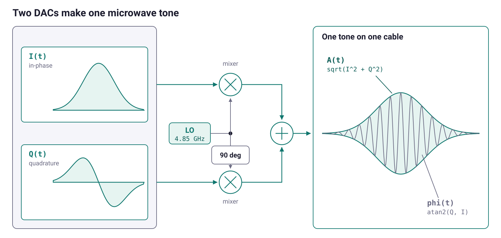

<style>
@font-face {
  font-family: "Plus Jakarta Sans";
  src: url("fonts/PlusJakartaSans-Regular.ttf") format("truetype");
  font-weight: 400; font-style: normal;
}
@font-face {
  font-family: "Plus Jakarta Sans";
  src: url("fonts/PlusJakartaSans-SemiBold.ttf") format("truetype");
  font-weight: 600; font-style: normal;
}
@font-face {
  font-family: "Plus Jakarta Sans";
  src: url("fonts/PlusJakartaSans-Bold.ttf") format("truetype");
  font-weight: 700; font-style: normal;
}

:root {
  --accent: #3d1a94;
  --accent-soft: #ece7fa;
  --accent2: #c6093f;
  --accent2-soft: #fbe7ec;
  --ink: #1c1c2e;
}
section {
  font-family: "Plus Jakarta Sans", -apple-system, "Segoe UI", Roboto, Helvetica, Arial, sans-serif;
  font-size: 26px;
  color: var(--ink);
  padding: 56px 72px;
  background: #ffffff;
}
h1, h2 { color: var(--accent); font-weight: 700; line-height: 1.1; }
h1 { font-size: 1.9em; }
h2 { font-size: 1.35em; }
h3 { color: var(--ink); }
strong { color: var(--accent); }
a { color: var(--accent); text-decoration: none; }
ul, ol { line-height: 1.45; }
code {
  background: var(--accent-soft); color: var(--accent);
  padding: 2px 7px; border-radius: 5px; font-size: 0.86em;
}
pre { font-size: 0.72em; line-height: 1.35; }
pre code { background: none; padding: 0; }
table { font-size: 0.76em; margin-left: 40px; }
th { background: var(--accent-soft); color: var(--accent); border-bottom: 2px solid var(--accent2); }
blockquote { font-size: 0.86em; color: #4a4a62; border-left: 4px solid var(--accent2); padding-left: 16px; }
footer { color: #9a9ab0; font-size: 0.5em; }
section::after { color: #b6b6c8; font-weight: 600; }

section.lead {
  display: flex; flex-direction: column;
  background: #05040c url("img/dark-gradient-bg.png") no-repeat center / cover;
  color: #fff; text-align: left;
  justify-content: center; align-items: flex-start;
}
section.lead h1 { font-size: 2.1em; margin: 0 0 0.2em; color: #fff; font-weight: 400; }
section.lead .sub { font-size: 1.15em; color: rgba(255,255,255,.85); }
section.lead .meta { font-size: 0.8em; color: rgba(255,255,255,.6); margin-top: 1.2em; }
section.lead .logo { width: 260px; margin: 0; }
section.lead .lead-text { width: 100%; margin-top: 50px; }

section.lead.center { justify-content: center; align-items: center; text-align: center; }
section.lead.center h1 { font-size: 2.3em; margin: 0 0 0.15em; }
section.lead.center .sub { margin: 0.2em 0; }
section.lead.center .logo { width: 460px; margin: 0 0 32px; }

section.divider {
  display: flex; flex-direction: column;
  background: linear-gradient(135deg, #c6093f 0%, #7f1997 45%, #2f2eff 100%);
  color: #fff; justify-content: center;
}
section.divider h1, section.divider h2, section.divider h3 { color: #fff; }
section.divider strong { color: #ffd866; }
section.divider .kicker { font-size: 0.8em; letter-spacing: .18em; text-transform: uppercase; color: #fff; opacity: .85; }
section.divider code { background: rgba(255,255,255,.18); color: #fff; }

section img { display: block; margin: 0 auto; }
.cap { font-size: 0.72em; color: #6a6a82; text-align: center; margin-top: 6px; }
.center { text-align: center; }
.small { font-size: 0.82em; }
.big {
  font-size: 1.5em; color: var(--accent); font-weight: 700; text-align: center;
  margin: 0.5em auto; padding: 0.4em 0.9em; max-width: fit-content;
  background: var(--accent-soft); border-radius: 12px;
}
.hl { color: var(--accent2); font-weight: 700; }
.callout {
  border-left: 4px solid var(--accent2); background: var(--accent2-soft);
  padding: 10px 18px; border-radius: 0 8px 8px 0; margin: 0.6em 0;
}

.qrgrid { display: flex; gap: 40px; justify-content: center; align-items: flex-start; margin-top: 28px; }
.qrgrid > div { text-align: center; width: 300px; }
.qrgrid img { width: 280px; height: 280px; background: #fff; padding: 8px; border: 1px solid #e6e6ef; border-radius: 10px; }
.qrgrid .lbl { font-weight: 700; color: var(--accent); margin: 14px 0 4px; font-size: 0.95em; }
.qrgrid .url { font-size: 0.72em; line-height: 1.35; word-break: break-word; }
.qrgrid .url a { color: #55556e; }
</style>

<!-- _class: lead -->
<!-- _paginate: false -->
<!-- _footer: '' -->


<div class="lead-text">

# Pulse-level Programming with QProgram

<p class="meta">IEEE Quantum Week · QCE 2026</p>

</div>

---

## The presenters

- **Vyron Vasileiadis**, Tech Lead at **Qilimanjaro Quantum Tech** · vyron@qilimanjaro.tech
- **Flavie Le Bars**, Quantum Software Engineer at **Qilimanjaro Quantum Tech** · flavie.lebars@qilimanjaro.tech

---

## Qilimanjaro

- **Qilimanjaro Quantum Tech** builds analog quantum processors on superconducting fluxonium qubits, plus the software stack that drives them.
- Full-stack: hardware, control electronics, software, and cloud access, under one roof.
- Founded in 2019, based in Barcelona.

---

## QProgram

- **QProgram** is the pulse-level layer of that stack, an open-source Python DSL.
- Hardware-agnostic: the same program targets a Qblox cluster, a QDevil QDAC, or the reference simulator.
- Modality- and paradigm-agnostic too, since a transmon and a fluxonium, or a gate model and an annealer, all come down to pulse-level programming.

---

## Links

<div class="qrgrid">
<div>

<div class="lbl">This tutorial</div>
<div class="url"><a href="https://github.com/qilimanjaro-tech/ieee-qce26-qprogram-tutorial">github.com/qilimanjaro-tech/<br>ieee-qce26-qprogram-tutorial</a></div>
</div>
<div>

<div class="lbl">QProgram source</div>
<div class="url"><a href="https://github.com/qilimanjaro-tech/qprogram">github.com/qilimanjaro-tech/qprogram</a></div>
</div>
<div>

<div class="lbl">Documentation</div>
<div class="url"><a href="https://qilimanjaro-tech.github.io/qprogram">qilimanjaro-tech.github.io/qprogram</a></div>
</div>
</div>

---

## Follow along

- **Full setup**: see the README, QR code above. Install, troubleshooting, the `uv` option.
- No hardware and no cloud account, since the reference platform ships in the wheel.
- Open `notebooks/01_introduction.ipynb` now. Its first two cells are the environment check.

---

## How we work

- The slides are the map, and the notebooks are the work.
- One part per notebook: each opens on a few slides, then moves into the notebook and one exercise.
- `notebooks/` holds the `# TODO` cells, `notebooks/solutions/` the answers.

| Topic | Notebook | Time |
|---|---|---|
| Background: the chip, the rack, and why a language of its own | | 40 min |
| Operations, schemas, waveforms, and the `.qp` file | `01_introduction` | 25 min |
| Variables, sweeps, and results | `02_basics` | 25 min |
| **Break** | | |
| Fragments, feedback, extending, and the machine | `03_advanced` | 75 min |
| Questions and close | | 10 min |

---

## What you will build

- A **pulse program** you can read, save, load and diff (`01_introduction`)
- A **resonator scan**, a **two-dimensional map**, and a **lockstep sweep** (`02_basics`)
- **Active reset**, one measurement deciding the next pulse (`03_advanced`)
- Your **own waveform, sweep source, and vendor operation** (`03_advanced`)
- A **platform** of your own, and a rack's **execution plan** (`03_advanced`)

---

## Acronyms

| Acronym | Stands for |
|---|---|
| **ADC** | Analog-to-digital converter |
| **AST** | Abstract syntax tree |
| **DAC** | Digital-to-analog converter |
| **DRAG** | Derivative removal by adiabatic gate |
| **DSL** | Domain-specific language |
| **FPGA** | Field-programmable gate array |
| **IQ** | In-phase / quadrature |
| **LC** | Inductor-capacitor (circuit) |
| **LO** | Local oscillator |

---

<!-- _class: divider -->

<p class="kicker">Concepts · slides only</p>

# The chip and the rack

### What a gate has to become before an instrument can emit it

---

## The harmonic problem

- What you calibrate is an LC circuit on a chip at 10 mK.
- Its energy levels are evenly spaced.
- A tone driving $|0\rangle \to |1\rangle$ drives $|1\rangle \to |2\rangle$ as hard.
- So no two levels can be addressed alone, and there is no qubit yet.

---

## The Josephson junction

- A Josephson junction replaces the inductor.
- Two aluminium films with a nanometre of oxide between them.
- Its current goes as $I_c\sin\varphi$, so it is nonlinear.
- Its inductance therefore depends on the current already flowing.
- It is the only nonlinear element in the circuit.

---

## Anharmonicity

$$\hat H = 4E_C\hat n^2 - E_J\cos\hat\varphi$$

- A parabola gives evenly spaced rungs.
- A cosine well gets shallower as you climb, so the rungs crowd.
- $f_{01}$ and $f_{12}$ then differ by the anharmonicity $\alpha$, here $-300$ MHz.
- A pulse narrower in spectrum than $|\alpha|$ addresses the bottom two levels.

---

## The transmon


<p class="cap">A capacitor across a Josephson junction, and the crowded ladder the cosine well gives it.</p>

---

## Tuning with flux

- Split the junction into a loop of two and the effective $E_J$ becomes tunable.
- A DC bias threads flux through that loop and moves $f_{01}$.
- The curve is a square root of a cosine, and its flat top is the **sweet spot**.
- There the slope against bias vanishes, so flux noise stops moving the frequency.

$$f_{01}(V) = f_{\max}\sqrt{\left|\cos\frac{\pi(V - V_0)}{V_\Phi}\right|}$$

---

## The control rack


<p class="cap">Three lines down to the chip and one line back, with attenuation going in and gain coming out.</p>

---

## The fridge


<p class="cap">Attenuation stage by stage going down, and the coldest amplifier sets the noise figure for the rest.</p>

---

## Three lines

| Line | What runs on it | What it does |
|---|---|---|
| **Drive** | A microwave tone near $f_{01}$ = 4.85 GHz | Rotates the state |
| **Readout** | A microwave tone near $f_r$ = 7.20 GHz | Interrogates a resonator coupled to the qubit |
| **Flux** | A slow, near-DC voltage through a coil | Moves $f_{01}$ |

- The drive line has no ADC, so nothing sent down it comes back.
- Every operation today writes a voltage onto one of these three lines.

---

## The rotating frame

- The Bloch vector precesses about $z$ at the qubit frequency.
- Move to a frame spinning about $z$ at the drive frequency.
- On resonance the precession stops and the state holds still.
- The instrument keeps that frame as a running phase on each output.

---

## Area and phase

$$\theta = \int_0^{\tau}\Omega(t)\,\mathrm{d}t$$

- The Rabi rate $\Omega(t)$ is proportional to the envelope, so only the area matters.
- Half the amplitude is half the area, so `X/2` is the same shape halved.
- The carrier phase $\phi$ is the azimuth, so `Y` is `X` advanced 90 degrees.

---

## Axis and angle


<p class="cap">The carrier phase picks the axis in the equatorial plane, the envelope area picks the angle.</p>

---

## Leakage

- A transmon is a ladder, not a two-level system.
- The $|1\rangle \to |2\rangle$ transition sits $|\alpha|$ below the one you drive.
- Population reaches it at order $(\Omega/\alpha)^2$, so a faster gate leaks more.
- Most comes back, and what stays is leakage no later gate recovers.
- A square edge is broadband and feeds the transition you are avoiding.

---

## DRAG

$$Q(t) = \beta\,\dot{I}(t)$$

- DRAG adds a second envelope on the quadrature 90 degrees from the one you play.
- Its shape is the derivative of the in-phase envelope.
- It cancels the leading transfer into $|2\rangle$ and the phase error left behind.
- First order gives $\beta \approx 1/|\alpha|$, and $\beta$ is calibrated per qubit.

---

## The IQ mixer



<p class="cap">Two envelopes on two DACs, one oscillator split ninety degrees, and one tone whose amplitude and phase are set independently.</p>

---

## Virtual Z gates

- A $Z$ rotation turns the frame the instrument already keeps.
- Apply $Z(\theta)$ by advancing the phase of every later pulse on that line.
- No waveform and no samples, so no duration and no error.
- A single-qubit unitary becomes two `X/2` pulses with phase advances around them.

---

## Two-qubit gates

Two qubits interact through a coupling, and a gate is an interval where you let it act.

| Route | What you do | Duration |
|---|---|---|
| **Flux** | Push one qubit until $\lvert 11\rangle$ and $\lvert 02\rangle$ meet, hold, come back | 40 to 100 ns |
| **All-microwave** | Drive A at B's frequency and let the coupling condition B on A | 200 to 500 ns |

- The flux route drags a qubit off its sweet spot, the bias where flux noise stops moving its frequency.
- The microwave route moves neither qubit.
- Two-qubit error runs five to ten times single-qubit error.
- Each pair is calibrated by a two-dimensional scan, amplitude against duration.

---

## Dispersive readout

- Every gate so far went out on a drive line that has no ADC.
- The qubit is read through a **resonator** beside it, coupled at rate $g$.
- The detuning $\Delta = f_{01} - f_r$ is far larger than $g$.
- At that ratio the two cannot exchange energy, so they shift each other.

---

## The dispersive shift

- The resonator sits at $f_r + \chi$ or $f_r - \chi$, and the qubit picks which.
- Park a tone between the two, and the transmission past the resonator carries the answer.
- The shift grows with the coupling and shrinks with the detuning.

$$\chi = \frac{g^2}{\Delta}\cdot\frac{\alpha}{\Delta+\alpha} = -1.8\ \text{MHz}, \qquad 2\chi = 3.6\ \text{MHz}$$

---

## The readout chain


<p class="cap">The resonator's two dips, the chain that carries the return up to an ADC, and the two clouds a threshold gets drawn between.</p>

---

## Integration weights

- The weights $w(t)$ are their own calibration, measured like any other number.
- Optimal is the difference between the mean $|0\rangle$ and $|1\rangle$ responses.
- That difference is taken sample by sample across the record.
- The window then weights the part where the two states separate.

---

<!-- _class: divider -->

<p class="kicker">Concepts · slides only</p>

# Why a language of its own

### Six requirements, and what a vendor dialect does to them

---

## Six requirements

- **Timed waveforms on named lines**, not gates on qubits.
- **A clock per line**, with barriers as explicit instructions.
- **Parameter sweeps**, nested or stepped in lockstep.
- **Shot averaging**, collapsing repeats into one number.
- **Acquisition with weights**, and a choice of raw, integrated, or classified output.
- **Conditional measurement**, active reset for example, decided in real time.

---

## One dialect per rack

- Experimental results get published in papers. The control code behind them isn't shared.
- Every vendor ships its own sequencer dialect.
- They are assembly shaped, because an FPGA has to meet every clock edge.
- Loops come out of registers, and waveform memory is addressed by hand.
- Porting to a second rack means rewriting experiments that were already correct.

---

## The loop decision

- Each script hard codes which loops run in the sequencer.
- Whatever is left runs on the host, one round trip per step.
- Running on the host can cost a factor of a hundred.
- The choice belongs to the rack, so it should not sit in the file.

---

## A Python DSL

- The experiment goes in the file, the rack stays outside it.
- QProgram is a Python builder that produces an AST.
- `program.play(...)` appends a typed `Play` node and sends nothing.
- Every other tool in the library reads that one tree.
- Not a compiler or a scheduler, since those sit behind `PlatformProtocol`.

---

## The architecture


<p class="cap">Your script builds a tree, a platform runs that tree, and files fall out as artifacts.</p>

---

<!-- _class: divider -->

<p class="kicker">Part 1 · notebooks/01_introduction.ipynb</p>

# Operations, schemas, waveforms, and the `.qp` file

### The operations, the lines they run on, the shapes they play, and the file they save to

---

## A program is a value

- Every operation you call appends one typed node to a tree and sends nothing anywhere.
- So what you hold afterwards is data your own code can print, compare, rewrite and save.
- Containers nest, and the nesting in the file is the nesting in the result.
- A program can therefore be checked and refused before an instrument exists.

---

## One signal path


- A bus is one signal path, from an instrument port to the chip.
- One qubit owns three lines that have nothing in common with each other.
- One feedline carries every readout at once, each on its own frequency.
- So an operation names the line, never the qubit.

---

## Every call names a property

| What a call does | The calls |
|---|---|
| Book time on a line | `play`, `measure`, `wait` |
| Bring lines to a common time | `sync` |
| Set or read one property of a line | `set_frequency`, `set_phase`, `reset_phase`, `set_gain`, `set_offset`, `set_parameter`, `get_parameter` |
| Run a named sub-program | `call` |

- Instrument verbs rather than gates, and each call appends exactly one node.
- Durations are nanoseconds, frequencies hertz, phases radians, gain and offset dimensionless.
- Which properties a machine can change, and when, is the machine's to declare. Part 3 reads that declaration.
- `measure` and `get_parameter` hand something back, and the other ten return `None`.

---

## One clock per bus


- Every bus keeps its own cursor, advanced only by what you write to that bus.
- A barrier holds every named bus until the furthest ahead has finished.
- A bare `sync()` covers every bus in the program; give it a list to sync only certain buses.

---

## What a measurement returns

- `measure` plays the readout tone and integrates what comes back, in one call.
- The second waveform is the integration window, and a flat window of ones is the default here.
- The reduction is a choice you make in the program: the ADC trace, the integrated point, the classified bit, or all three.
- Ask for a field you never requested and it is a `KeyError`.
- A handle is a name, so a result is indexed by what you called the measurement.

---

## A schema, not a string

```python
program.measure(q[0].drive, "readout", "weights")
-> Bus 'q0/drive' does not support acquisition (acquires=False).
```

- A raw string bus name builds, prints and saves, and nothing checks it until the run.
- A `BusSchema` hands back a reference that is still a string and carries two facts about copper.
- Which shape the line takes, real-valued or two-path, and whether an ADC listens to it.
- Both become an error on the line that made the mistake, and raw strings skip both on purpose.

---

## Waveforms are data

- A waveform describes one envelope and knows nothing about hardware.
- Equality is structural, so two `Gaussian(0.5, 40, 8)` built in different cells are one waveform.
- A program can then report how many distinct envelopes it plays.
- Nothing in a shape names a line, so the bus decides whether a `Square` is a readout tone or a flux excursion.

---

## A file you can diff

```diff
-    play "q0/drive" IQDrag(amplitude=0.62, duration=40, sigma=10, beta=0.15)
+    play "q0/drive" IQDrag(amplitude=0.31, duration=40, sigma=10, beta=0.15)
```

- One statement per line, so a retune shows up as one changed line under version control.
- Nothing truncated, nothing implied, and no dependency on a numpy version or a database.
- The amplitudes that go stale live in a waveform library beside the program, resolved per bus.
- `rebind` re-spells every bus through another schema, so a second rack needs no find and replace.

---

## The simulator

- `qp.simulate(program, model=...)` walks the tree in pure Python.
- It models the shape of the experiment: the nesting, the repetition, one record per `measure`.
- It models no timing and no waveform physics, so `wait` changes no number.
- The program you write and the analysis you run on the results are the same ones a rack would run, and that is where the work lives.

---

## Exercise 1.1

> 🧩 Bias the flux line, prepare the qubit, read it out, and round-trip the program through a file.

- Then measure the flux bus and watch the schema refuse it.
- The flux line has no ADC, and the schema knows that before any hardware does.

---
<!-- _class: divider -->

<p class="kicker">Part 2 · notebooks/02_basics.ipynb</p>

# Variables, sweeps, and results

### The first three scans of the calibration order, written as programs that come back labeled

---

## A program with holes

- A program with no holes can only be run once, and the fab does not deliver the frequency you asked for.
- A variable is the hole, and a sweep fills it once per iteration.
- Arithmetic on one builds an expression and computes nothing, so a hole can sit inside a pulse envelope.
- The label and units you declare name the axes of every figure drawn from the result.

---

## Anatomy of a program


<p class="cap"><code>sweep</code> creates an axis, <code>average</code> creates none, <code>measure</code> creates a record, and <code>play</code> carries the variable down.</p>

---

## A source, not a list

| `KIND` | What it promises |
|---|---|
| `linear` | Point $i$ is exactly `start + step * i` |
| `arbitrary` | Every other source, and its points have to be shipped |

- A bare list is refused, because a source declares its kind before the run starts and a list declares none.
- A source also reports its length without running, which is how a lockstep pair is checked and how the result arrays are sized.
- `qp.Values` is arbitrary even when the numbers are evenly spaced, because a list proves nothing about itself.
- Eight ship, and three of them take a source and hand back one, so they compose.

---

## Averaging over shots

- `average(shots)` repeats the body and hands back the mean, and the shot count is nowhere in the shape.
- Amplifier noise and projection noise both fall as $1/\sqrt{N}$, so halving the noise costs four times the time.
- The same array position holds a bit at one shot and a population at five hundred.
- A readout frequency placed on the resonance costs nothing per shot.

---

## The measurement model

- The interpreter asks a measurement model for one sample per shot, and every measured number in a run comes from it.
- Every figure in the notebook therefore comes out of five constants and three short formulas you can read.
- `env` holds every variable a loop currently binds, keyed by the id you declared.
- Any object with a `sample(bus, env)` method does the job, so a model may carry state.

---

## The grid bounds the answer

- A 20 MHz window in 200 kHz steps puts about seven samples across a 1.5 MHz resonance.
- An argmin can never beat the step size, so that grid locates the resonator to 200 kHz.
- A finer answer costs either a finer grid or a fit to the shape of the curve.

---

## The saturation ceiling

$$P_1(f, a) = \frac{1}{2}\,\frac{\Omega^2}{\Omega^2 + (f - f_{01})^2}, \qquad \Omega \propto a$$

- The qubit answers only through the resonator, so finding it takes a second tone swept past $f_{01}$.
- A strong continuous drive balances excitation against decay, so the population saturates at one half.
- A two-tone peak above that ceiling means the classifier is wrong.
- The same formula sets the width, so a stronger drive broadens the line while the peak stays at one half.

---

## A rectangle or a diagonal

```python
with program.sweep(amp, ...):                          # a rectangle
    with program.sweep(freq, ...):
        ...
with program.sweep(amp, ...) | program.sweep(freq, ...):   # a diagonal
    ...
```

- Nested `with` statements are nested loops, so a two-deep nest is a rectangle of points.
- `|` advances both on the same tick instead, and one dimension comes back carrying two coordinates.
- The map cost 861 points at 200 shots, and most of them sat off resonance.
- Walking the ridge is 21 points over the same body, once the map has found it.

---

## Exercise 2.1

> 🧩 Park the drive on resonance, step its amplitude, and calibrate a full rotation from the curve.

$$P(a) = \sin^2\!\left(\frac{\pi a}{2 a_\pi}\right)$$

- The top of that curve is flat, so shot noise moves an argmax a step or two off the true peak.
- The half-way crossing sits on the steepest part of the same curve, where the same noise usually leaves the answer where the noiseless curve puts it.
- Read the half rotation off the rising branch, then double it.

---
<!-- _class: divider -->

<p class="kicker">Session 2 · Part 3 · notebooks/03_advanced.ipynb</p>

# Fragments, feedback, and the machine

### Two seams for writing less, two for vocabulary the core must never ship, and two for the machine that runs it

---

## One definition, many call sites

```text
fragment x_pulse(drive, amp):
  play drive IQDrag(amplitude=amp, duration=40, sigma=10, beta=0.1)

body:
  x_pulse("q0/drive", 0.5)
  x_pulse("q0/drive", 0.25)
```

- $T_1$, Ramsey and echo are prepare, wait, read out, and only the middle changes.
- Three copies of the pulse definition drift apart at the next recalibration, and the three curves stop being comparable.
- A `@fragment` is one named, parameterized definition, and each call site stays one line in the file.
- `expand()` inlines every call, so keep `measure` in the program where the handle stays yours.

---

## A branch inside the shot

```
excited before: 0.305
excited after:  0.029
```

- A branch inside the shot cannot be faked by a host round trip, because the decision has to land before the qubit relaxes.
- The condition is one comparison of one classified state against an integer, and nothing wider.
- Passive reset idles several $T_1$ before every shot. Active reset measures first and flips only the shots that came back excited.
- One extra measurement and one conditional pulse take 30 percent hot down to 3.

---

## Three extension seams

| You want | You write | You get for free |
|---|---|---|
| A pulse shape the DSL lacks | A `Waveform` subclass | Serialization, structural equality, validation, plotting |
| A sweep axis the DSL lacks | A `SweepSource` subclass | Serialization, a capability token, length checks, coordinates |
| An operation the DSL will never have | An `Operation` plus a `VendorNamespace` | `program.<vendor>.<op>()`, a `require` line, a capability token |

- A language that cannot be extended gets forked, and a fork stops being portable.
- A capability token is a dotted name a rack can refuse the node by.
- The extension travels inside the file, so a colleague loads it without knowing what to import.
- A swept parameter arrives as a `qp.Expression`, so a shape that does not resolve it fails inside numpy naming neither the waveform nor the variable.

---

## One portable file

```text
#!QProgram 0.2

require twpa 0.1

body:
  var flux_amp label="Flux amplitude" units="DAC units"

  twpa.set_pump "q0/readout" 7900000000.0
  average 200:
    for flux_amp in Chebyshev(start=0.0, stop=0.5, num=21):
      play "q0/flux" HalfSine(amplitude=flux_amp, duration=40)
      sync "q0/flux" "q0/readout"
      measure "q0/readout" "readout" "weights" name="m0" fields=["state"]
```

- The `require` header names each vendor, and the loader imports what it names.
- Only the `qprogram.vendors` entry-point group is scanned.
- A vendor nobody claims fails by name, naming the package to install.
- So an archived file still loads years later, in an interpreter that imported nothing.

---

## Two vendors, one name

```text
op.set_offset            qblox True  qdac False
vendor.qdac.set_offset   qblox False qdac True
```

- Every operation sets or reads a property of a bus, and a profile is where a machine says which properties it has.
- A Qblox bus changes its offset between one pulse and the next, so `qblox-default-v1` claims the core `op.set_offset`.
- A QDAC channel takes every change through the host at millisecond latency, so `qdac-default-v1` refuses that name and offers its own.
- Borrowing a core name whose meaning does not fit would make the two look interchangeable.

---

## What a platform supplies

- Six questions: the chip it is wired to, the buses it exposes, the knobs per bus and platform wide, what it can run, and `execute`.
- Only the last one is work. `validate`, `plan` and `explain` arrive already written off the descriptor.
- Between `execute` and the arrays the protocol says nothing at all. Compile, upload, run, assemble.
- That work is where a vendor's expertise lives, and it is deliberately outside the interface.

---

## Two racks

| | Rack A, yours | Rack B, next door |
|---|---|---|
| Drive and readout | One box, one shared clock | One box, one shared clock |
| Flux line | A DC-coupled output on that box | A 20-bit DC source over Ethernet |
| Bus names | `q0/drive` | `drive_q0` |

- The flux row is the one that changes how the program runs.
- Heavy filtering keeps a flux line quiet and gives it millisecond time constants, so nothing behind it steps a loop.
- Your program named neither rack, neither wiring choice, and neither calibration.
- The same file is the deliverable in both labs, and `rebind` settles the naming.

---

## Two loops, one file

```text
  average 200:
    for bias in Linspace(start=-0.05, stop=0.15, num=41):
      set_offset q[0].flux bias
      set_frequency q[0].drive 4850000000.0
      play q[0].drive "pi"
      sync q[0].drive q[0].readout
      measure q[0].readout "probe" "weights" name="m0" fields=["state"]
```

- The outer loop steps a DC level onto a slow, filtered line, milliseconds per step.
- Everything inside it retunes a source, fires a pulse and reads out, microseconds per step.
- The file never recorded which of the two is which, and it should not have.
- The rest of this part is how a rack settles it, and what that costs when it settles it badly.

---

## The cost of a loop

| Where the loop runs | One execution | 41 points, 200 shots |
|---|---|---|
| Real time, passive reset | 2 us readout plus $5T_1$ | **0.75 s** |
| Real time, active reset | About 10 us | **0.08 s** |
| Host, one round trip per execution | About 1 ms | **8.2 s** |

- The qubit lifetime $T_1$ is 18 us on this chip, so passive reset spends 90 of those 92 microseconds waiting.
- A host round trip costs three orders of magnitude more than a real-time one.
- Which one you get is a property of the rack, and the rest of this part makes it visible.

---

## rt and host

- Every capability slot splits into an `rt` half and a `host` half, the two **domains** a node can run in.
- `rt` runs inside the instrument, and `host` is dispatched from the control PC.
- Either half may be `None`, and a `None` is a statement about the wiring.
- A slot is keyed by kind of bus, so `("q", "flux")` is separate from `("q", "drive")` and describes a class of rack rather than one wiring list.

---

## Tokens, limits, predicates

| Mechanism | The question it answers | Examples |
|---|---|---|
| **Token** | Is this in the set? | `op.play`, `waveform.iq_drag`, `sweep.logspace` |
| **Limit** | Is this number small enough? | `max_loop_nesting`, `max_measurements` |
| **Predicate** | Given the rest of the program, is this legal? | No arbitrary sweep at `Wait.duration` |

- Every node answers `required_capabilities()` with a set of dotted strings computed from its own data.
- Supply is a set the rack publishes, so checking one is a hash lookup and no instrument is attached.
- The validator reads four numeric limits and passes over every other key a profile publishes.
- A token set is small enough for a vendor to ship as a named, versioned profile.

---

## Reading the plan

| Label | What it means |
|---|---|
| `[rt]` | Real time, inside the instrument |
| `[host]` | Dispatched from the control PC, one round trip per iteration |
| `[rt\|host]` | Either one, and the platform picks |
| `[--]` | Nothing can run it, and an error above says why |

- The plan is the second half of what `qp.validate` returns.
- Read it from the leaves up, because an operation that can run nowhere empties the loop holding it.
- So the loop's own line carries no reason, and an empty child propagates exactly one level.
- `qp.explain` draws the same plan as a tree, marking each diagnostic inline, `!!` error, `~` warning, `i` info.

---

## Two domains


<p class="cap">Drive and readout run in real time, flux on a slow DAC, so the bias loop runs host side and drags the averaging with it.</p>

---

## The rewrite is opt-in

- A block runs where its worst child runs, so the averaging fell to the host and pays the round trip 200 times per point.
- `qp.optimize(program, caps)` swaps the two loops and hoists the bias write between them.
- It is not unconditionally equivalent. It takes all 200 shots of one point before moving on, where the program as written interleaved passes over the whole sweep.
- The same experiment for a stationary device, a different one under drift, so the call stays yours.

---

## One bare sync

- A bare `sync()` pulls every bus into one domain intersection.
- The flux bus has no real-time half, so that sync lands host side in the middle of a run of real-time operations.
- Nothing can be hoisted across it, and the rewrite is lost with no error message.
- Naming the two buses you mean keeps the sync real time and the rewrite alive.

---

## A rule about your own wiring

- A predicate is code, and it is where a lab writes down a fact about its own wiring that no vendor profile carries.
- This rack's flux DAC will not go past a tenth of a volt, and that number lives in a predicate.
- The validation context is what makes the rule expressible, because the values live in the loop that binds the variable.
- It yields a `Diagnostic` to refuse, or a `DomainConstraint` that moves a loop host side rather than failing the program.

---

## Diagnostics as data

```
$ python -m qprogram.lsp check flux_sweep.qp   (exit 1)
[{"line": 18, "end_line": 18, "severity": "error", "code": "parse-error",
  "message": "Line 19: bus path 'q[0].drve' does not resolve against the
  program schema: 'q' has no bus 'drve'. Available: drive, readout, flux"}]
```

- `qp.validate` returns diagnostics and raises nothing, so one call serves three callers with different needs.
- An editor that wants every problem, a build that wants a non-zero exit, a notebook that wants to keep going.
- `execute` is the caller that turns an error into an exception, so nothing broken reaches a rack.
- The editor and the parser cannot drift apart, because both are this one module.

---

## Exercise 3.1

> 🧩 Add a vendor measurement field, then prove it is legal on one rack and refused on another.

- One token registration widens `measure` itself, because the `fields=` vocabulary is read off the capability registry.
- The token makes the field legal and the executor allocates the array for it.
- Nothing in the reference platform knows how to produce a photon count, so the counts come back zero.

---

## Where to go next

- **Docs**: [qilimanjaro-tech.github.io/qprogram](https://qilimanjaro-tech.github.io/qprogram) · **Source**: [github.com/qilimanjaro-tech/qprogram](https://github.com/qilimanjaro-tech/qprogram)
- The Reference section is normative, and `qp.lark` is the machine-readable grammar.
- Read `qprogram-qblox` or `qprogram-qdac` before writing your own extension.
- Write a rule your lab cares about as a predicate.
- Issues and pull requests are welcome.

---

## Other events at QCE 2026

- **Paper: QProgram**: *A Hardware-Agnostic DSL for Portable Pulse-Level Quantum Programming* (Q-SET 2026), Vyron Vasileiadis, Flavie Le Bars, David Arcos. Wed Sep 16, 10:00–11:30 AM EDT, Room 714B.
- **Poster: QiliSim**: *A C++ Quantum Simulator for Digital/Analog Workflows*, Luke Mortimer, Ameer Azzam, Vyron Vasileiadis, Natàlia Padilla. Board 76, Hall E. Mon Sep 14, 18:30–20:00 (reception); Tue Sep 15, 11:30–12:30; Wed Sep 16, 14:30–15:00.
- **Poster: QPySequence**: *Pythonic Sequence Programming for Qblox Hardware*, Flavie Le Bars, Vyron Vasileiadis, Joel Pérez Díaz. Board 86, Hall E. Mon Sep 14, 18:30–20:00 (reception); Tue Sep 15, 11:30–12:30; Wed Sep 16, 14:30–15:00.

---
<!-- _class: lead center -->
<!-- _footer: '' -->


# Thank you

<p class="sub">Questions welcome.</p>
<p class="sub">The notebooks are yours to keep.</p>

<p class="meta">vyron@qilimanjaro.tech · flavie.lebars@qilimanjaro.tech · QCE 2026</p>
