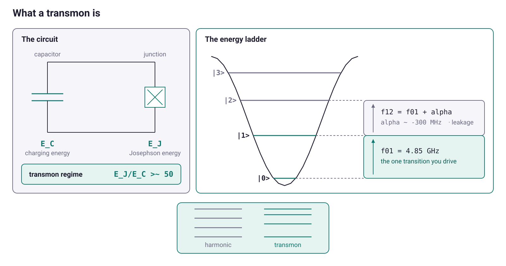
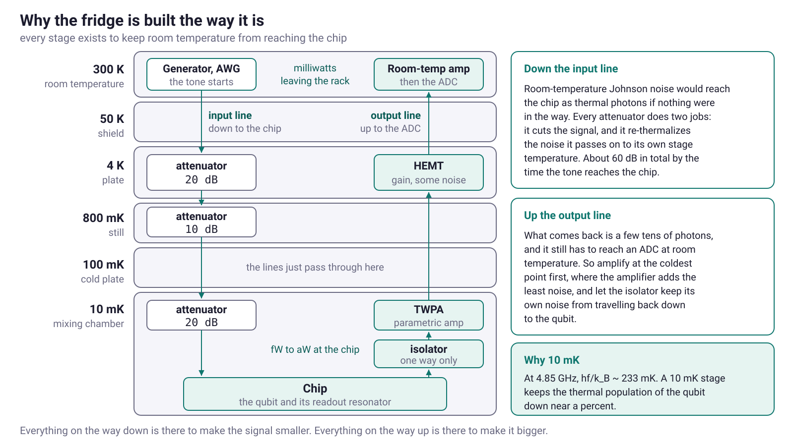
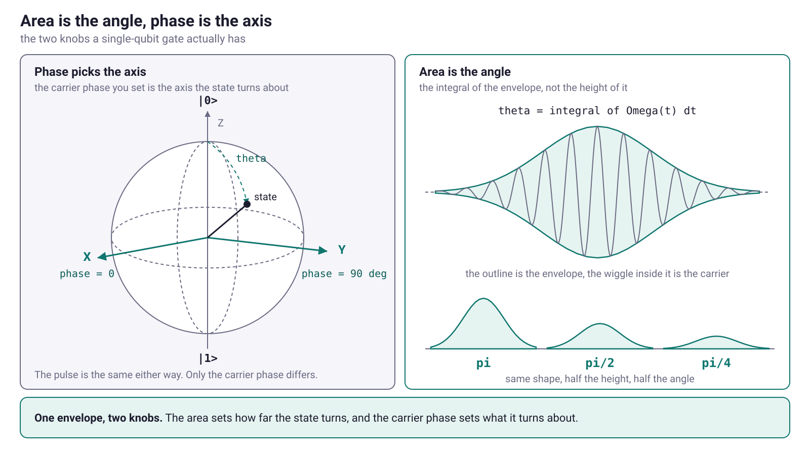
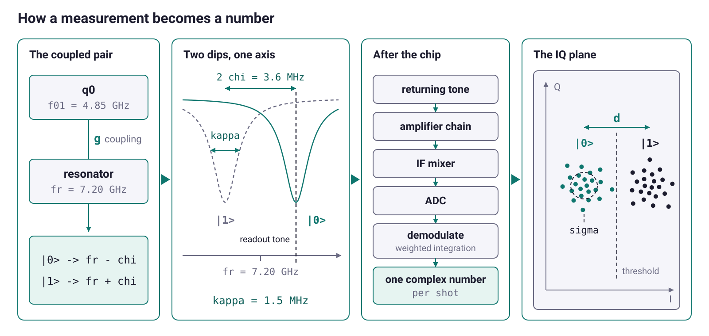

<style>
:root {
  --accent: #0f766e;
  --accent-soft: #e6f4f1;
  --ink: #1c1c2e;
}
section {
  font-family: -apple-system, "Segoe UI", Roboto, Helvetica, Arial, sans-serif;
  font-size: 26px;
  color: var(--ink);
  padding: 56px 72px;
  background: #ffffff;
}
h1, h2 { color: var(--accent); font-weight: 700; line-height: 1.1; }
h1 { font-size: 1.9em; }
h2 { font-size: 1.35em; }
h3 { color: var(--ink); }
strong { color: var(--accent); }
a { color: var(--accent); text-decoration: none; }
ul, ol { line-height: 1.45; }
code {
  background: var(--accent-soft); color: #0b5f58;
  padding: 2px 7px; border-radius: 5px; font-size: 0.86em;
}
pre { font-size: 0.72em; line-height: 1.35; }
pre code { background: none; padding: 0; }
table { font-size: 0.76em; }
th { background: var(--accent-soft); color: var(--accent); }
blockquote { font-size: 0.86em; color: #4a4a62; border-left: 4px solid var(--accent); padding-left: 16px; }
footer { color: #9a9ab0; font-size: 0.5em; }
section::after { color: #b6b6c8; font-weight: 600; }

section.lead { text-align: center; justify-content: center; }
section.lead h1 { font-size: 2.4em; margin-bottom: 0.1em; }
section.lead .sub { font-size: 1.15em; color: #55556e; }
section.lead .meta { font-size: 0.8em; color: #8a8aa0; margin-top: 1.4em; }

section.divider {
  background: linear-gradient(135deg, #0f766e 0%, #08403c 100%);
  color: #fff; justify-content: center;
}
section.divider h1, section.divider h2, section.divider h3 { color: #fff; }
section.divider strong { color: #ffd866; }
section.divider .kicker { font-size: 0.8em; letter-spacing: .18em; text-transform: uppercase; opacity: .8; }
section.divider code { background: rgba(255,255,255,.18); color: #fff; }

.cap { font-size: 0.72em; color: #6a6a82; text-align: center; margin-top: 6px; }
.center { text-align: center; }
.small { font-size: 0.82em; }
.big { font-size: 1.5em; color: var(--accent); font-weight: 700; text-align: center; margin: 0.3em 0; }

.qrgrid { display: flex; gap: 40px; justify-content: center; align-items: flex-start; margin-top: 28px; }
.qrgrid > div { text-align: center; width: 300px; }
.qrgrid img { width: 280px; height: 280px; background: #fff; padding: 8px; border: 1px solid #e6e6ef; border-radius: 10px; }
.qrgrid .lbl { font-weight: 700; color: var(--accent); margin: 14px 0 4px; font-size: 0.95em; }
.qrgrid .url { font-size: 0.72em; line-height: 1.35; word-break: break-word; }
.qrgrid .url a { color: #55556e; }
</style>

<!-- _class: lead -->
<!-- _paginate: false -->
<!-- _footer: '' -->

# Programming a Superconducting Qubit

<p class="sub">Pulse-Level Control and Calibration with QProgram</p>

<p class="meta">IEEE Quantum Week · QCE 2026</p>

---

## The presenters

- **Vyron Vasileiadis**, Tech Lead at **Qilimanjaro Quantum Tech** · vyron@qilimanjaro.tech
- **Flavie Le Bars**, Quantum Software Engineer at **Qilimanjaro Quantum Tech** · flavie.lebars@qilimanjaro.tech
- **Qilimanjaro** builds quantum computers and the software stack that drives them.
- **QProgram** is the pulse-level layer of that stack, an open-source Python DSL.

---

## Links

<div class="qrgrid">
<div>

<div class="lbl">This tutorial</div>
<div class="url"><a href="https://github.com/qilimanjaro-tech/ieee-qce26-qprogram-tutorial">github.com/qilimanjaro-tech/<br>ieee-qce26-qprogram-tutorial</a></div>
</div>
<div>

<div class="lbl">QProgram source</div>
<div class="url"><a href="https://github.com/qilimanjaro-tech/qprogram">github.com/qilimanjaro-tech/qprogram</a></div>
</div>
<div>

<div class="lbl">Documentation</div>
<div class="url"><a href="https://qilimanjaro-tech.github.io/qprogram">qilimanjaro-tech.github.io/qprogram</a></div>
</div>
</div>

---

## Follow along

- **Local**: `pip install "qprogram[viz]" scipy`, Python 3.11 to 3.14.
- **Colab**: the first cell of each notebook installs what is missing.
- No hardware and no cloud account, since the reference platform ships in the wheel.
- Open and run `notebooks/00_setup.ipynb` now.
- Its last cell draws a resonator dip near 7.2 GHz.

---

## How we work

- The slides are the map, and the notebooks are the work.
- Each part is a short concept, a live code-along, then one 🧩 exercise.
- `notebooks/` holds blank `# TODO` cells, `notebooks/solutions/` holds the answers.
- Interrupt me, above all with a lab story that contradicts the slide.

---

## Schedule

| Part | Notebook | Topic | Time |
|---|---|---|---|
| | | opening, the chip, and the language | 25 min |
| 1 | `01_pulse_programs` | The program is data | 20 min |
| 2 | `02_sweeps_and_results` | Sweeps, averaging, and results | 20 min |
| 3 | `03_finding_the_qubit` | Finding the qubit | 25 min |
| 4 | `04_coherence_and_feedback` | Coherence, single shots, feedback | 30 min |
| 5 | `05_one_program_many_machines` | Capabilities, plans, porting | 30 min |
| 6 | `06_extending_and_shipping` | Extending, shipping, capstone | 20 min |
| | | questions and close | 10 min |

Two sessions, and the break between them lands after Part 3.

---

## What you will build

- a **calibrated qubit**: resonator frequency, qubit frequency, and a $\pi$ pulse (Parts 2 and 3)
- **coherence numbers**: $T_1$, $T_2^{*}$, and $T_2$ echo (Part 4)
- **single-shot readout** and **active reset** (Part 4)
- the **same calibration ported to a second rack** (Part 5)
- your **own waveform, sweep source, and vendor operation** (Part 6)

---

## The harmonic problem

- What you calibrate is an LC circuit on a chip at 10 mK.
- Its energy levels are evenly spaced.
- A tone driving $|0\rangle \to |1\rangle$ drives $|1\rangle \to |2\rangle$ as hard.
- So no two levels can be addressed alone, and there is no qubit yet.

---

## The Josephson junction

- A Josephson junction replaces the inductor.
- Two aluminium films with a nanometre of oxide between them.
- Its current goes as $I_c\sin\varphi$, so it is nonlinear.
- Its inductance therefore depends on the current already flowing.
- It is the only nonlinear element in the circuit.

---

## Anharmonicity

$$\hat H = 4E_C\hat n^2 - E_J\cos\hat\varphi$$

- A parabola gives evenly spaced rungs.
- A cosine well gets shallower as you climb, so the rungs crowd.
- $f_{01}$ and $f_{12}$ then differ by the anharmonicity $\alpha$, here $-300$ MHz.
- A pulse narrower in spectrum than $|\alpha|$ addresses the bottom two levels.

---

## The transmon



<p class="cap">A capacitor across a Josephson junction, and the crowded ladder the cosine well gives it.</p>

---

## The design ratio

- $E_J/E_C$ large puts the phase deep in the cosine well.
- Stray charge then stops shifting the levels.
- Charge dispersion falls as $e^{-\sqrt{8E_J/E_C}}$, anharmonicity only as $-E_C$.
- Above roughly 50 the charge sensitivity has gone.
- The ratio trades charge noise against gate speed.

---

## Why 5 GHz

- The thermal scale $hf/k_B$ at $f_{01}$ is 233 mK.
- A 10 mK stage sits far below it.
- The band is also where coax, circulators and generators can be bought.
- Real devices sit warmer, at 40 to 60 mK, leaving about one percent excited.
- Part 4 resets that population rather than waiting.

---

## The control rack


<p class="cap">Three lines down to the chip and one line back, with attenuation going in and gain coming out.</p>

---

## Attenuation

- A 50 ohm resistor at room temperature radiates into every mode.
- At the drive frequency that is 1300 photons per mode.
- The qubit sits on one of them.
- Each stage's attenuator therefore re-thermalizes the line to its own plate.
- Microwatts at the generator arrive as attowatts at the chip.

---

## The fridge



<p class="cap">Attenuation stage by stage going down, and the coldest amplifier sets the noise figure for the rest.</p>

---

## Three lines

| line | what runs on it | what it does |
|---|---|---|
| **drive** | a microwave tone near $f_{01}$ = 4.85 GHz | rotates the state |
| **readout** | a microwave tone near $f_r$ = 7.20 GHz | interrogates a resonator coupled to the qubit |
| **flux** | a slow, near-DC voltage through a coil | moves $f_{01}$ |

- The drive line has no ADC, so nothing sent down it comes back.
- Every operation today writes a voltage onto one of these three lines.

---

## The rotating frame

- The Bloch vector precesses about $z$ at the qubit frequency.
- Move to a frame spinning about $z$ at the drive frequency.
- On resonance the precession stops and the state holds still.
- The instrument keeps that frame as a running phase on each output.

---

## Area and phase

$$\theta = \int_0^{\tau}\Omega(t)\,\mathrm{d}t$$

- The Rabi rate $\Omega(t)$ is proportional to the envelope, so only the area matters.
- Half the amplitude is half the area, so `X/2` is the same shape halved.
- The carrier phase $\phi$ is the azimuth, so `Y` is `X` advanced 90 degrees.

---

## Axis and angle



<p class="cap">The carrier phase picks the axis in the equatorial plane, the envelope area picks the angle.</p>

---

## Leakage

- A transmon is a ladder, not a two-level system.
- The $|1\rangle \to |2\rangle$ transition sits $|\alpha|$ below the one you drive.
- Population reaches it at order $(\Omega/\alpha)^2$, so a faster gate leaks more.
- Most comes back, and what stays is leakage no later gate recovers.
- A square edge is broadband and feeds the transition you are avoiding.

---

## DRAG

$$Q(t) = \beta\,\dot{I}(t)$$

- DRAG adds a second quadrature alongside the envelope you play.
- Its shape is the derivative of the in-phase envelope.
- It cancels the leading transfer into $|2\rangle$ and the phase error left behind.
- First order gives $\beta \approx 1/|\alpha|$, and $\beta$ is calibrated per qubit.

---

## Virtual Z gates

- A $Z$ rotation turns the frame the instrument already keeps.
- Apply $Z(\theta)$ by advancing the phase of every later pulse on that line.
- No waveform and no samples, so no duration and no error.
- A single-qubit unitary becomes two `X/2` pulses with phase advances around them.

---

## Two-qubit gates

Two qubits interact through a coupling, and a gate is an interval where you let it act.

| route | what you do | duration |
|---|---|---|
| **flux** | push one qubit until $\lvert 11\rangle$ and $\lvert 02\rangle$ meet, hold, come back | 40 to 100 ns |
| **all-microwave** | drive A at B's frequency and let the coupling condition B on A | 200 to 500 ns |

- The flux route drags a qubit off its sweet spot, the microwave route moves neither.
- Two-qubit error runs five to ten times single-qubit error.
- Each pair is calibrated by a two-dimensional scan, amplitude against duration.

---

## Dispersive readout

- Every gate so far went out on a drive line that has no ADC.
- The qubit is read through a **resonator** beside it, coupled at rate $g$.
- The detuning $\Delta = f_{01} - f_r$ is far larger than $g$.
- At that ratio the two cannot exchange energy, so they shift each other.

---

## The dispersive shift

- The resonator sits at $f_r + \chi$ or $f_r - \chi$, and the qubit picks which.
- Park a tone between the two, and the transmission past the resonator carries the answer.
- The shift grows with the coupling and shrinks with the detuning.

$$\chi = \frac{g^2}{\Delta}\cdot\frac{\alpha}{\Delta+\alpha} = -1.8\ \text{MHz}, \qquad 2\chi = 3.6\ \text{MHz}$$

---

## The readout chain



1. The resonator fills, and the return picks up a state-dependent phase.
2. A parametric amplifier at 10 mK, a HEMT at 4 K, then warm amplifiers.
3. Down-conversion to an intermediate frequency, an ADC, then demodulation.
4. Multiply by the weights, sum over the window, one complex number per shot.

---

## Integration weights

- The weights $w(t)$ are their own calibration, measured like any other number.
- Optimal is the difference between the mean $|0\rangle$ and $|1\rangle$ responses.
- That difference is taken sample by sample across the record.
- The window then weights the part where the two states separate.

---

## Readout fidelity

- The resonator has to fill before the return says anything, at rate $\kappa$.
- Integrating longer beats down the amplifier noise, and $T_1$ caps the window.
- Cloud separation $d$ grows with photon number and with $2\chi/\kappa$.
- Information per photon peaks near $2\chi = \kappa$, and this chip sits at 2.4.
- The error is an erfc of $d$ against the cloud width $\sigma$.

$$\varepsilon = \tfrac{1}{2}\,\mathrm{erfc}\!\left(\frac{d}{2\sqrt{2}\,\sigma}\right) \qquad 4\sigma \to 2\% \qquad 6\sigma \to 0.1\%$$

---

## Coherence times

| | this chip | what it measures |
|---|---|---|
| $T_1$ | 18 us | energy leaving the qubit and not coming back |
| $T_2^{*}$ | 9 us | plus every source of frequency wander, unfiltered |
| $T_2$ echo | 16 us | plus a $\pi$ pulse in the middle, refocusing slow noise |

$$\frac{1}{T_2} = \frac{1}{2T_1} + \frac{1}{T_\varphi}$$

- Relaxation feeds half its rate into dephasing, so $T_2 \le 2T_1$ always.
- Pure dephasing $T_\varphi$ is the rest, and the gap between the last two rows is its slow part.

---

## Noise sources

- **Two-level defects** in the junction oxide and every metal interface.
- **Quasiparticles**, broken Cooper pairs raised by stray infrared and cosmic rays.
- **$1/f$ flux noise**, the reason a tunable qubit has a sweet spot.
- **Purcell decay** down the readout line, at rate $\kappa(g/\Delta)^2$.
- All four drift, so one coherence number is a snapshot.

---

## The device

| | | |
|---|---|---|
| $f_{01}$ = 4.85 GHz | $f_r$ = 7.20 GHz | $\Delta$ = $-2.35$ GHz |
| $\kappa$ = 1.5 MHz ($Q_L$ = 4800) | $\chi$ = $-1.8$ MHz | $2\chi/\kappa$ = 2.4 |
| $T_1$ = 18 us | $T_2^{*}$ = 9 us | $T_2$ = 16 us |

Every fit you run has to land on these, and a circuit carries none of them.

---

## Six measured numbers

A circuit says `X(q0)`. Before an instrument can emit it, somebody has to supply this.

```text
40 ns DRAG envelope,  IQ pair,  carrier 4.8501 GHz,  amplitude 0.6176,  sigma 10 ns,  beta 0.1
```

- Nothing in `X(q0)` names a line, a carrier, or an envelope.
- Each of these numbers came out of its own scan.
- They drift, so the scans are run again.

---

## Calibration order

<p class="big">resonator → qubit → π pulse → coherence → readout → reset</p>

- Each scan consumes the answer from the one before it.
- You cannot find the qubit before you can read it out.
- You cannot fit a $\pi$ amplitude before you know where the qubit is.

---

## Six requirements

- **Timed waveforms on named lines**, not gates on qubits.
- **A clock per line**, with barriers as explicit instructions.
- **Parameter sweeps**, nested or stepped in lockstep.
- **Shot averaging**, collapsing repeats into one number.
- **Acquisition with weights**, and a choice of what to keep.
- **A branch on a measurement**, inside the shot.

---

## One dialect per rack

- A paper travels between labs, and the control code behind it never has.
- Every vendor ships its own sequencer dialect.
- They are assembly shaped, because an FPGA has to meet every clock edge.
- Loops come out of registers, and waveform memory is addressed by hand.
- Porting to a second rack means rewriting experiments that were already correct.

---

## The loop decision

- Each script hard codes which loops run in the sequencer.
- Whatever is left runs on the host, one round trip per step.
- Running on the host can cost a factor of a hundred.
- The choice belongs to the rack, so it should not sit in the file.

---

## A Python DSL

- The experiment goes in the file, the rack stays outside it.
- QProgram is a Python builder that produces an AST.
- `program.play(...)` appends a typed `Play` node and sends nothing.
- Every other tool in the library reads that one tree.
- Not a compiler or a scheduler, since those sit behind `PlatformProtocol`.

---

## The architecture


<p class="cap">Your script builds a tree, a platform runs that tree, and files fall out as artifacts.</p>

---

## Creating a program

```python
import qprogram as qp
from qprogram.buses import BusSchema

schema = BusSchema.transmon()
q = schema.q

program = qp.QProgram(label="first_readout", schema=schema)
program.set_frequency(q[0].readout, 7.2e9)
m0 = program.measure(q[0].readout, readout_pulse, weights)
```

- A program is a label, a schema, and the calls you append.
- `BusSchema.transmon()` gives each qubit a drive line and a readout line.
- Without a schema, bus names are plain strings and nothing is checked.

---

## Buses

- A bus is one signal path, from an instrument port to the chip.
- One qubit owns several lines that have nothing in common.
- One feedline carries every readout at once, each on its own frequency.
- So an operation names the line, never the qubit.

---

## One signal path


<p class="cap">Instrument ports on the left, bus names in the middle, and the chip lines on the right.</p>

---

## Operations

The verbs are instrument actions, not gates.

| what it does | QProgram |
|---|---|
| set the modulation frequency of the pulses | `set_frequency` |
| set or zero the phase reference | `set_phase`, `reset_phase` |
| scale the whole output path | `set_gain` |
| offset the whole output path | `set_offset` |
| output one pulse envelope | `play` |
| idle a bus | `wait` |
| bring buses to a common time | `sync` |
| output a pulse, integrate the return, optionally classify it | `measure` |
| repeat a block | `average`, `sweep` |

---

## Waveforms

- A waveform describes one envelope and knows nothing about hardware.
- `envelope()` gives samples, `get_duration()` gives nanoseconds, `plot()` draws it.
- `Square` for readout, `Gaussian` for drive, `FlatTop` for a swept length.
- `Arbitrary` for samples you bring, `Ramp` and `SuddenNetZero` for flux.
- Drive and readout lines are IQ, so they take an `IQPair` or an `IQDrag`.

---

## Blocks

```python
with program.block():                        # grouping, changes nothing
    ...
with program.average(shots=200):             # the shot loop
    with program.sweep(freq, qp.Range(...)):  # one dimension per sweep
        ...
with program.if_(m0.state == 1):             # a branch on a classified bit
    ...
```

- Four blocks nest, and nesting in the file is nesting in the result.
- `sweep` adds a dimension, `average` takes one away.
- `if_` reads a measurement outcome inside the shot.

---

## Measurement handles

```python
m0 = program.measure(q[0].readout, readout_pulse, weights)

print(m0.name)                                       # q0/readout/m0
print(m0 == qp.MeasurementHandle("q0/readout/m0"))   # True
```

- `measure` returns a handle, and the handle is only a name.
- Names are allocated per bus unless you pass `name=`.
- `result.get(m0)` reads the data back after the run.
- A handle rebuilt from a file still names the same measurement.

---

## The text form

```python
qp.save(program, "first_readout.qp")
reloaded = qp.load("first_readout.qp")

assert reloaded.body == program.body
assert qp.loads(qp.dumps(program)).body == program.body
```

- `.qp` is one statement per line, with indentation for nesting.
- Quoting is the type distinction, so a bare `q[0].readout` is a bus.
- Nothing is truncated and nothing is implied.
- It depends on no numpy version, no sidecar, and no database.

---

## The simulator

- `qp.simulate(program, model=...)` walks the tree in pure Python.
- It models the shape: nesting, averaging, one record per `measure`.
- It models no timing and no waveform physics, so `wait` changes no number.
- The program and the analysis are byte-identical here and on hardware.

---

<!-- _class: divider -->

<p class="kicker">Part 1 · notebooks/01_pulse_programs.ipynb</p>

# The program is data

### A readout pulse, a drive pulse, and the tree they build

---

## Prepare and read

```text
body:
  block:
    set_frequency q[0].drive 4850000000.0
    set_gain q[0].drive 1.0
    reset_phase q[0].drive
    play q[0].drive IQDrag(amplitude=0.62, duration=40, sigma=10, beta=0.15)
    wait q[0].drive 4
  sync q[0].drive q[0].readout
  measure q[0].readout "readout" "weights" name="q0/readout/m0" fields=["state", "iq"]
```

- Prepare on the drive bus, hold at a barrier, then read on the readout bus.
- Each call appends exactly one node, and `body.walk()` hands them back in order.
- The tree is now in memory, and nothing has reached the rack.

---

## Build-time checks

```text
scratch.play(q[0].drive, Square(amplitude=0.5, duration=40))
-> Bus 'q0/drive' is an IQ channel but received a single-channel Waveform (Square).

scratch.measure(q[0].drive, "readout", "weights")
-> Bus 'q0/drive' does not support acquisition (acquires=False).
```

- The schema types each operation against the bus it names.
- `qp.ValidationError` raises at the call that made the mistake, not at run time.
- Raw string bus names skip both checks, on purpose.

---

## One clock per bus


<p class="cap">Each bus advances only when you write to it, so the readout can start during the drive.</p>

---

## The sync barrier

```python
program.sync([q[0].drive, q[0].readout])   # hold both buses
program.sync()                             # every bus in the program
program.sync([])                           # raises, rather than guess
```

- A barrier holds every named bus until the furthest-ahead one has finished.
- Without it you measure the pulse rather than the state.
- The compiler turns that declaration into real timing on the sequencer.

---

## Waveforms are data

```
same shape:        True     # Gaussian(0.5, 40, 8) == Gaussian(0.5, 40, 8)
one sigma apart:   False
the pi pulse:      True
distinct in a set: 2
```

- Waveforms compare and hash by structure, not by identity.
- So a program can report how many distinct envelopes it really plays.
- On the pi pulse `get_Q()` peaks at 0.0056, the DRAG correction from the opening.

---

## Waveform aliases

```text
  play q[0].drive "pi"
after binding: play q[0].drive IQDrag(amplitude=0.62, duration=40, sigma=10, beta=0.15)
```

- `play(q[0].drive, "pi")` names a pulse instead of writing one down.
- `with_waveforms(dict)` returns a new program with the numbers bound in.
- An amplitude written into the script goes stale as the chip drifts.
- Version the sequence, and keep the amplitudes in a file of their own.

---

## The file as a diff

```diff
-    play q[0].drive IQDrag(amplitude=0.62, duration=40, sigma=10, beta=0.15)
+    play q[0].drive IQDrag(amplitude=0.31, duration=40, sigma=10, beta=0.15)
```

- The `.qp` text is line oriented, so a retune shows up as one changed line.
- Compare `body.elements` pairwise to find which child moved.
- The change localises to `body[0][3]`, the `play` inside the block.

---

## Exercise 1.1

> 🧩 Build a two-qubit prepare-and-read sequence, then let the schema catch a `measure` on a drive line.

- One program, both drives at their own `f01`, then a bare `sync()`.
- Measure both readout buses and print the two handle names.
- The names tell you how per-bus numbering works.

---

<!-- _class: divider -->

<p class="kicker">Part 2 · notebooks/02_sweeps_and_results.ipynb</p>

# Sweeps and results

### Resonator spectroscopy, then a punchout map

---

## Anatomy of a program


<p class="cap"><code>sweep</code> creates an axis, <code>average</code> collapses one, <code>measure</code> creates a record, and <code>play</code> carries the variable down.</p>

---

## Variables

```python
freq = program.variable("ro_freq", label="Readout frequency", units="Hz")
with program.average(shots=200):
    with program.sweep(freq, qp.Range(7.19e9, 7.21e9, 0.2e6)):
        program.set_frequency(q[0].readout, freq)
        m0 = program.measure(q[0].readout, "readout", "weights")
```

- A variable is a hole in the program, and the sweep fills it.
- You need the hole because the fab does not deliver an exact frequency.
- Arithmetic on a variable builds an expression tree, computing nothing.

---

## Sweep sources

| source | kind | reach for it when |
|---|---|---|
| `qp.Range(start, stop, step)` | linear | you know the spacing |
| `qp.Linspace(start, stop, num)` | linear | you know the point count |
| `qp.Values(seq)` | arbitrary | you have a measured or calibrated list |
| `qp.Logspace(start, stop, num)` | arbitrary | the axis spans decades |

- A linear source runs out of a sequencer register, with nothing uploaded.
- An arbitrary source is a table, uploaded or stepped from the host.
- `Values` stays arbitrary even when its numbers are evenly spaced.

---

## Averaging

- `average(shots)` repeats the body and hands back the mean.
- It is the one block that removes a dimension instead of adding one.
- Amplifier noise and projection noise both fall as $1/\sqrt{N}$.
- Halving the noise therefore costs four times the measurement time.

---

## Resonator spectroscopy

```
f_r    measured 7.200000 GHz    true 7.200000 GHz
kappa  measured 1.509 MHz     true 1.500 MHz
```

- The resonator hangs off the feedline, so the trace dips on resonance.
- $|S_{21}|$ is not a Lorentzian, so subtract the baseline and square it.
- The result is a plain Lorentzian whose full width is $\kappa$.
- An argmin can never beat the step size you chose.

---

## Punchout

$$n_{\text{crit}} = \frac{\Delta^2}{4g^2} \approx 37 \ \text{photons on this chip}$$

- The dispersive approximation has a validity limit, and it is a photon number.
- Below the limit the resonator sits at $f_r + \chi$, above it on bare $f_r$.
- A map of `ro_amp` against `ro_freq` shows where the crossover falls.
- Park a few decibels below it to keep the two states apart.

---

## Labeled results

```
dims ('ro_amp', 'ro_freq', 'IQ')   shape (25, 41, 2)   outermost sweep first
coordinate: {'long_name': 'Readout frequency', 'units': 'Hz'}
```

- `result.get(m0)` hands back a labeled `xarray`, one record per `measure`.
- Dimension names are the variable ids you chose, not positions.
- `result.plot(m0)` picks a line or a heatmap from the shape and returns the `Axes`.

---

## Lockstep sweeps

```
dims:   ('ro_amp|ro_freq', 'IQ')   shape (25, 2)
coords: ['ro_amp', 'ro_freq', 'IQ']
measurements: 25 against 1025 for the full map
```

- Nested `with` statements are nested loops, so a two-deep nest is a grid.
- `sweep(a) | sweep(b)` advances both on the same tick instead.
- One dimension comes back carrying two coordinate arrays, a diagonal cut.
- Unequal lengths raise on the `|` line, before anything runs.

---

## Exercise 2.1

> 🧩 Scan both readout resonators in one lockstep sweep, and explain the single 41-long dimension that comes back.

- Declare `f0` and `f1`, and sweep them in parallel over their own bands.
- Write one response function, since `bus` says which resonator answers.
- Print the dims of each record and the dip frequency it found.

---

<!-- _class: divider -->

<p class="kicker">Part 3 · notebooks/03_finding_the_qubit.ipynb</p>

# Finding the qubit

### Two-tone spectroscopy, Rabi, and the flux arc

---

## Two tones

- The qubit answers only through the resonator, so you need two tones.
- Park the readout in the dip, and sweep a second tone past $f_{01}$.
- On resonance the resonator moves by $2\chi$, and the parked tone falls off.

```text
    for drive_freq in Linspace(start=4840000000.0, stop=4860000000.0, num=81):
      set_frequency q[0].readout 7200000000.0
      set_frequency q[0].drive drive_freq
      play q[0].drive IQPair(I=Square(amplitude=0.02, duration=4000), ...)
      sync
      measure q[0].readout "readout" "weights" fields=["state"]
```

---

## The saturation ceiling

- A strong continuous drive balances excitation against decay.
- The excited population then saturates, and the ceiling is 0.5.
- The height of the peak tells you which scan you are looking at.
- A two-tone peak above that ceiling means the classifier is wrong.

---

## Rabi

- Fix the shape and the duration, then sweep the drive amplitude.
- The angle follows the envelope area, so the population traces $\sin^2$.
- The first maximum is the $\pi$ pulse amplitude.
- A coherent rotation is not a pumped steady state, so the ceiling is one.

$$P(a) = P_0 + C \sin^2\!\left(\frac{\pi a}{2 a_\pi}\right)$$

---

## The pi amplitude

- Write the model in terms of $a_\pi$ rather than a generic sinusoid.
- `curve_fit` then hands back an error bar on the number you want.
- The same fit also returns contrast and floor, two health checks.

```
a_pi fitted : 0.6176 +/- 0.0022     contrast: 0.998   floor: 0.006
a_pi true   : 0.6200                error:    -0.39%
```

---

## The waveform library

- The library resolves each alias per bus, in three tiers, most specific first.
- Exact is one bus, family every index of a kind, global everything.
- It is its own text file, a `.wfl`, kept outside the `.qp` on purpose.
- Two qubits never share a $\pi$ amplitude, so drive pulses go exact.

```text
#!WaveformLibrary 1.0
"pi"  q[0].drive = IQDrag(amplitude=0.6176, duration=40, sigma=10, beta=0.1)
"x90" q[0].drive = IQDrag(amplitude=0.3088, duration=40, sigma=10, beta=0.1)
"readout" q[*].readout = IQPair(I=Square(amplitude=0.2, duration=2000), Q=Square(...))
"weights" = IQPair(I=Square(amplitude=1.0, duration=2000), Q=Square(...))
```

---

## The flux arc

- `BusSchema.flux_tunable_transmon()` gives each qubit a third line, a DC bias.
- The bias threads flux through a SQUID loop and moves $f_{01}$.
- The curve you measure is a square root of a cosine.
- Its flat top is the sweet spot, where the slope against bias vanishes.

$$f_{01}(V) = f_{\max}\sqrt{\left|\cos\frac{\pi(V - V_0)}{V_\Phi}\right|}$$

---

## Two loops

- Two `for` loops, written identically, on boxes that share nothing.
- The inner one retunes a source and fires a pulse, microseconds per step.
- The outer one writes a DC level into a slow, filtered line.
- The program never recorded which was which, and Part 5 settles it.

```text
    for bias in Linspace(start=-0.15, stop=0.25, num=25):
      set_offset q[0].flux bias
      for arc_freq in Linspace(start=4300000000.0, stop=4900000000.0, num=61):
        set_frequency q[0].drive arc_freq
```

---

## Exercise 3.1

> 🧩 Fit the $\pi/2$ amplitude from the rising branch of the Rabi curve, instead of halving the $\pi$ amplitude.

- A $\pi/2$ pulse is usually taken as half the $\pi$ amplitude.
- On a real drive line, the measured value can differ by percent.

---

<!-- _class: divider -->

<p class="kicker">Part 4 · notebooks/04_coherence_and_feedback.ipynb</p>

# Coherence and feedback

### T1, Ramsey, echo, single shots, and active reset

---

## Fragments

- Every experiment here is prepare, wait, read out.
- Only the middle changes, so write the pulse once.
- A `@fragment` is a named, parameterized sub-program.
- Fragments carry the pulses, `measure` stays in the program.

```text
fragment x180(drive, amp):
  play drive IQDrag(amplitude=amp, duration=40, sigma=10, beta=0.1)

body:
  x180(q[0].drive, 0.62)
```

---

## T1

- Invert the qubit with a $\pi$ pulse, wait, then read it out.
- The excited population then decays exponentially with the wait.
- Energy leaves through the readout line, oxide defects, and quasiparticles.
- Sweep out to about three $T_1$, since later points only measure noise.

---

## Ramsey

- Two $\pi/2$ pulses, with the wait between them swept.
- Park the drive off resonance on purpose, so fringes appear.
- One fit reads the envelope and the fringe rate together.
- The fringe rate is your drive frequency error, 400 kHz here by design.
- Correct the drive by it and repeat, until the residual is under a kilohertz.

$$P_1(t) = \tfrac{1}{2}\left(1 + \cos(2\pi \delta t)\right) e^{-t/T_2^*}$$

---

## Hahn echo

- $T_2^*$ mixes true decoherence with shot to shot drift.
- A $\pi$ pulse halfway subtracts the phase of the first half.
- Noise slower than the sequence refocuses, faster noise does not.
- What survives is $T_2$, longer than $T_2^*$.

---

## The three fits

| | fitted | true |
|---|---|---|
| $T_1$ | 18.00 us | 18.00 us |
| $T_2^{*}$ | 9.03 us | 9.00 us |
| $T_2$ echo | 15.65 us | 16.00 us |

- These are the three rows from the opening, now measured.
- The ordering $T_2^* < T_2 < 2T_1$ has to hold.
- A set that breaks it is a bug in the analysis.

---

## Measurement fields

| field | shape | what it is |
|---|---|---|
| `MF.RAW` | `(*sweeps, time, IQ)` | the ADC trace, averaged over shots |
| `MF.IQ` | `(*sweeps, IQ)` | integrated I and Q, the default |
| `MF.STATE` | `(*sweeps)` | classified per shot, averaged into a population |

- One `measure` call can ask for all three.
- Multiply `raw` by the weights and sum to get `iq`.
- Threshold `iq` and you get `state`.
- `get` raises rather than substituting a field you never requested.

---

## Single shots

- `average` is the only thing collapsing the shots.
- Drop it and make the shot index a sweep variable.
- Each point then holds exactly one shot.
- A sweep variable nothing reads still drives its loop.
- Two clouds appear in the IQ plane, one per state.

---

## Assignment error

- Project each shot onto the line joining the clouds, then threshold.
- Measured error includes the preparation error, not just the readout.
- Assignment error isolates the readout, given the true state.
- Error follows an erfc of separation over width, so it falls steeply.

```
blob separation  = 3.8 sigma
threshold        = +1.101
measured error   = 5.3%   (readout plus preparation)
assignment error = 3.1%   (readout alone)
```

---

## Conditionals

- A measurement handle is the one value a branch can read.
- `if_`, `elif_` and `else_` are context managers that chain.
- The condition must be a measurement-state predicate, nothing wider.
- An FPGA evaluates it between one pulse and the next, in tens of nanoseconds.

```text
  for shot in Range(start=0.0, stop=399.0, step=1.0):
    measure q[0].readout "readout" "weights" name="check" fields=["state"]
    if check.state == 1:
      x180(q[0].drive, 0.62)
      sync
      measure q[0].readout "readout" "weights" name="verify" fields=["state"]
    else:
      wait q[0].drive 40
```

---

## Active reset

- Passive reset idles for several $T_1$ before every shot.
- Active reset measures, then fires a $\pi$ pulse only if needed.
- The arm that did not run holds `NaN`, never a zero.
- The model starts the qubit hotter than any device you would keep.

```
reset fired on 74 of 400 shots
population before reset = 18.5%     population after reset = 1.0%
```

---

## Exercise 4.1

> 🧩 Build active reset on 400 single shots and report the excited population before and after.

- One `shot` variable swept with `qp.Range(0, 399, 1)`, and no `average`.
- `check` asks for `state`, and the excited arm calls `x180` then measures again.
- Recover the population with `np.where(np.isnan(verify), check, verify)`.

---

<!-- _class: divider -->

<p class="kicker">Part 5 · notebooks/05_one_program_many_machines.ipynb</p>

# One program, many machines

### The same calibration, a different rack

---

## Two racks

| | rack A, yours | rack B, next door |
|---|---|---|
| drive line | fast AWG with a sequencer | fast AWG with a sequencer |
| readout line | same box, shared clock | same box, shared clock |
| flux line | the same AWG, a DC-coupled output | a 20-bit DC source over Ethernet |
| bus names | `q0/drive` | `drive_q0` |
| pulse shapes | your calibration | their calibration |

- The flux row is the one that changes how the program runs.
- Your program never said which loop was hardware and which was software.
- The split is a property of the rack, not of the experiment.

---

## The flux line

- Flux noise dephases the qubit, and the frequency tracks the bias directly.
- Heavy filtering keeps the line quiet, and gives it millisecond time constants.
- Rack B puts a 20-bit DC source there, over Ethernet, with no FPGA.
- A loop that steps that voltage runs from the control PC.

---

## Tokens

```text
Block          ['block.block']
Average        ['block.average']
Sweep          ['block.sweep', 'sweep.linear', 'sweep.linspace']
SetOffset      ['expr.variable', 'op.set_offset']
SetFrequency   ['op.set_frequency']
Play           ['op.play', 'waveform.alias']
Sync           ['op.sync']
Measure        ['measure.fields.state', 'op.measure', 'waveform.alias', 'waveform.iq']
```

- Every node answers `required_capabilities()` with a set of dotted strings.
- A **token** is set membership, so checking one is a hash lookup.
- The prefix decides where it is checked, on the bus or on the platform.
- The set depends on the node's data, not just on its class.

---

## Three mechanisms

| mechanism | the question it answers | examples |
|---|---|---|
| **token** | is this in the set? | `op.play`, `waveform.iq_drag`, `sweep.logspace` |
| **limit** | is this number small enough? | `max_loop_nesting`, `max_measurements` |
| **predicate** | given the rest of the program, is this legal? | no arbitrary sweep at `Wait.duration` |

- A rack states what it can do in these three forms.
- A token set is small enough for a vendor to publish as a profile.
- The validator checks all three against the tree, with no instrument attached.

---

## Platform capabilities

```python
caps = qp.PlatformCapabilities(
    bus={("q", "drive"): fast, ("q", "readout"): fast, ("q", "flux"): slow},
    platform=base,
    default_bus_profile=fast,
)
```

- `bus` gives one profile per element kind and bus kind slot.
- `platform` holds the bus-less half, where blocks and sweep shapes live.
- `default_bus_profile` covers a raw-string bus and any slot not listed.

---

## rt and host

- Every slot splits into an `rt` half and a `host` half.
- `rt` is the sequencer, `host` is the lab server.
- Either half may be `None`, and a `None` is a statement about the wiring.
- Rack B's flux slot has `rt=None`, so no loop there runs in hardware.

---

## Validation

```text
[warning] forced-host: Block 'Average' falls back to host-side execution:
          contains host-side-only sub-block 'Sweep'.        (at body[0])
```

- `qp.validate(program, caps)` returns a diagnostics list and an execution plan.
- It never raises, so a broken program stays data you can print.
- `execute` turns an error into an exception, so nothing broken reaches a rack.
- Severity is what you act on, and every diagnostic carries a path back to a line.

---

## The execution plan

| label | what it means |
|---|---|
| `[rt]` | real time, inside the sequencer |
| `[host]` | dispatched from the control PC, one round trip per iteration |
| `[rt\|host]` | either one, and the platform picks |
| `[--]` | nothing can run it, and an error above says why |

- The plan is the second half of what `qp.validate` returns.
- Operations come first, then the loops that contain them.
- `qp.explain` draws the same plan as a tree, marking each diagnostic inline, `!!` error, `~` warning, `i` info.

---

## Two domains


<p class="cap">Drive and readout sit on the sequencer, flux on the DAC, so the bias loop runs host side.</p>

---

## The cost of a loop

A host loop pays one network round trip per iteration.

| where the loop runs | one execution | the whole scan |
|---|---|---|
| sequencer, passive reset | 2 us readout plus $5T_1$ | **2 s** |
| sequencer, active reset | a few us | **0.2 s** |
| host, one round trip per execution | about 1 ms | **20 s** |

---

## The rewrite

```text
before                            after
average 200:                      for bias in Linspace(...):
  for bias in Linspace(...):        set_offset q[0].flux bias
    set_offset q[0].flux bias       average 200:
    play q[0].drive ...               play q[0].drive ...
    measure q[0].readout ...          measure q[0].readout ...
```

- A block runs where its worst child runs, so the average fell to the host.
- `qp.optimize(program, caps)` hoists the bias write out of the average.
- The host does one DAC write per point, the sequencer runs the rest.
- It is opt-in, because grouping the shots of a point is not interleaving them.

---

## The broadcast

```python
program.sync([drive, readout])   # both buses have a sequencer
program.sync()                   # every bus, including the flux line
```

- A bare `sync()` aligns every bus the program touches.
- The flux bus has no sequencer, so that sync lands host side.
- `optimize` then refuses to hoist across it.
- Naming the two buses keeps the sync real-time, and the rewrite survives.

---

## Limits and predicates

- A limit is a hard wall, because sequencer loops run out of registers.
- The validator reads four numeric limits, from loop nesting to the shortest legal wait.
- A predicate is code, since it asks about two nodes at once.
- A lab can add a predicate about its own wiring.

---

## A stricter profile

```text
└─ average 200:                                 [rt|host]  i reorderable-averaging
   └─ for bias in Linspace(-0.05, 0.15, 101):   [--]       !! mixed-domain
      ├─ qdac.set_offset q[0].flux bias         [host]
      ├─ play q[0].drive "saturation"           [rt]
      └─ measure q[0].readout "readout" ...     [rt]
```

- A published profile lists what the box implements, not what the language knows.
- `qdac-default-v1` refuses `op.set_offset`, so the write becomes `program.qdac.set_offset`, a vendor operation.
- The same loop that only warned on rack B is now an error.
- `qp.optimize` turns an illegal program into a legal one.

---

## Rebind

```text
original: ['q0/drive', 'q0/flux', 'q0/readout']
renamed:  ['drive_q0', 'flux_q0', 'readout_q0']
moved:    ['q1/drive', 'q1/flux', 'q1/readout']
```

- `rebind` re-resolves every bus through the schema, so the refs stay typed.
- Find and replace gives strings that look right and carry no metadata.
- `elements=` moves the experiment to another qubit, and the handle follows.
- The calibration lives in its own `.wfl`, so the two diffs stay separate.

---

## Exercise 5.1

> 🧩 Port the two-dimensional flux arc to a rack that names its buses `drive_q0` style, and check the diagnostics still match.

- Rebind with `BusNaming("{kind}_{element}{index}")` and print the buses before and after.
- Validate against `caps` and compare the codes with the original's.
- Run `qp.optimize` and name the diagnostic that predicted the outcome.

---

<!-- _class: divider -->

<p class="kicker">Part 6 · notebooks/06_extending_and_shipping.ipynb</p>

# Extending and shipping

### A waveform, a sweep source, a vendor operation, and one portable file

---

## Three extension seams

| you want | you write | you get for free |
|---|---|---|
| a pulse shape the DSL lacks | a `Waveform` subclass | serialization, structural equality, validation, plotting |
| a sweep axis the DSL lacks | a `SweepSource` subclass | serialization, a token, lockstep length checks, coordinates |
| an operation the DSL will never have | an `Operation` plus a `VendorNamespace` | `program.<vendor>.<op>()`, a `require` line, a token |

- A language that cannot be extended gets forked, and a fork is not portable.
- Nothing in the core knows any vendor name.
- Serialization is read off your constructor, so the arguments have to be the state.

---

## A custom waveform

```python
@qp.register_waveform
class HalfSine(Waveform):
    def __init__(self, amplitude: float | qp.Expression, duration: int) -> None:
        self.amplitude, self.duration = amplitude, duration
    def envelope(self, resolution: int = 1) -> np.ndarray:
        amplitude = self.amplitude
        if isinstance(amplitude, qp.Expression):
            amplitude = amplitude.evaluate_or_raise()
        n = self.duration // resolution
        return amplitude * np.sin(np.pi * np.arange(n) / n)
    def get_duration(self) -> int: return self.duration
```

- You owe two methods, `envelope(resolution)` and `get_duration()`.
- `plot`, `area`, `peak_amplitude` and `spectrum` arrive from the base class.
- Without that branch a swept amplitude reaches numpy and fails there instead.
- `register_waveform_token` gives the shape a token a rack can refuse.

---

## A custom sweep source

```python
@qp.register_sweep_source
class Chevron(qp.SweepSource):
    KIND = "arbitrary"
    TOKEN = "sweep.chevron"
    def __init__(self, center: float, span: float, num: int) -> None:
        self.center, self.span, self.num = center, span, num
    def length(self) -> int: return self.num
    def values(self):
        return np.linspace(self.center - self.span / 2, self.center + self.span / 2, self.num)
```

- `length()` is static, so a parallel loop checks it before anything runs.
- `KIND` declares linear or arbitrary, and a sequencer only ramps linear.
- `values()` feeds the interpreter, the xarray coordinate, and `optimize`.
- A callable answers none of the three, so it cannot be a source.

---

## A vendor operation

```python
class FridgeNamespace(qp.VendorNamespace):
    def set_attenuation(self, bus: str, db: float) -> None:
        self._append(SetAttenuation(bus=bus, db=db))

qp.QProgram.register_vendor("fridge", FridgeNamespace)
qp.register_vendor_version("fridge", "0.1.0")
qp.register_vendor_operation("fridge", "set_attenuation", SetAttenuation)
qp.register_capability_tokens("vendor.fridge.set_attenuation")
```

- `register_vendor` makes `program.fridge` resolve on any `QProgram`.
- `register_vendor_version` fixes the version the `require` line carries.
- `register_vendor_operation` teaches the writer and the parser.
- `register_capability_tokens` lets a rack say yes or no.

---

## One portable file

```text
#!QProgram 1.0
require fridge 0.1
body:
  var flux_amp label="Flux amplitude" units="DAC units"
  fridge.set_attenuation q[0].drive 20.0
  average 200:
    for flux_amp in Chevron(center=0.42, span=0.2, num=21):
      play q[0].flux HalfSine(amplitude=flux_amp, duration=40)
      sync
      measure q[0].readout "readout" "weights" fields=["state"]
```

- All three extensions in one file, with no patch to the core.
- The `require` line names the vendor and the version the file was written against.
- A rack without `vendor.fridge.set_attenuation` marks that node `[--]`.
- The refusal is a diagnostic, not a syntax error.

---

## Entry points

```toml
[project.entry-points."qprogram.vendors"]
qblox = "qprogram_qblox"
```

- The entry-point name is the vendor namespace, the value is the module.
- A `require` line makes the loader import that module and register it.
- Only the `qprogram.vendors` group is scanned.
- A vendor nobody claims fails by name, naming the package to install.

---

## The calibration diff

```diff
-  set_frequency q[0].readout 7200000000.0
+  set_frequency q[0].readout 7200400000.0
-  average 200:
+  average 400:
-    for amp in Linspace(start=0.0, stop=1.0, num=41):
+    for amp in Linspace(start=0.0, stop=0.8, num=41):
```

- Two runs of the same Rabi experiment, saved as text.
- The readout frequency was retuned, because the resonator moved.
- The shot count doubled.
- The amplitude range came down, because the $\pi$ pulse landed lower than expected.
- `diff`, code review and `git blame` all work on a text file.

---

## The checker

```
$ python -m qprogram.lsp check rabi_hand_edited.qp   (exit 1)
  line 18: [error] parse-error: Line 18: bus path 'q[0].drve' does not resolve
  against the program schema: 'q' has no bus 'drve'. Available: drive, readout, flux
```

- `check` parses with the production parser and validates against the reference platform.
- Diagnostics come out as JSON, and an error exits non-zero.
- It fits a pre-commit hook or a CI job, with no extra dependency.
- The message names the buses the chip has, because the file declares its schema.

---

## Exercise 6.1

> 🧩 Add a vendor measurement field, then prove it is legal on one rack and rejected on another.

- Register the token `measure.fields.counts`.
- Measure with `fields=("counts", MF.STATE)` and print the `.qp` body.
- Validate against the reference platform, then against a rack without the token.
- Read the counts back and say why they are zero.

---

## The capstone

```
quantity              measured        true    error
f_r (GHz)               7.2000      7.2000     0.0%
f_01 (GHz)              4.8500      4.8500     0.0%
a_pi (DAC)              0.6191      0.6200     0.2%
T1 (us)                17.8634     18.0000     0.8%
T2* (us)                8.9410      9.0000     0.7%
T2 echo (us)           15.8509     16.0000     0.9%
```

- Seven steps in order, resonator spectroscopy through to active reset.
- Each step consumes the answer measured by the one before it.
- T1, Ramsey and echo drive with the $\pi$ pulse that Rabi fitted.
- The run leaves a `.qp` per step plus one `calibration.wfl`.
- Six primitives under all of it, assembled into one tree and run by a swappable platform.

---

## Where to go next

- **Docs**: [qilimanjaro-tech.github.io/qprogram](https://qilimanjaro-tech.github.io/qprogram) · **Source**: [github.com/qilimanjaro-tech/qprogram](https://github.com/qilimanjaro-tech/qprogram)
- The Reference section is normative, and `qp.lark` is the machine-readable grammar.
- Read `qprogram-qblox` or `qprogram-qdac` before writing your own extension.
- Write a rule your lab cares about as a predicate.
- Issues and pull requests are welcome.

---

<!-- _class: lead -->
<!-- _footer: '' -->

# Thank you

<p class="sub">Questions, and the notebooks are yours to keep</p>

<p class="meta">vyron@qilimanjaro.tech · flavie.lebars@qilimanjaro.tech · QCE 2026</p>
