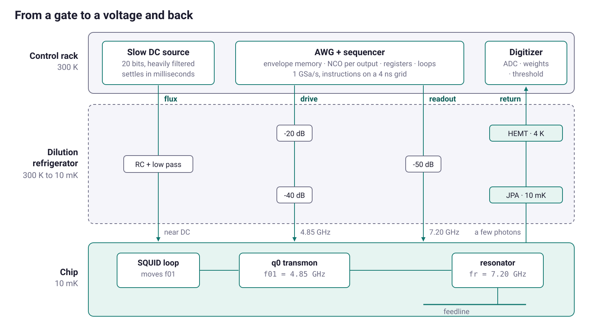
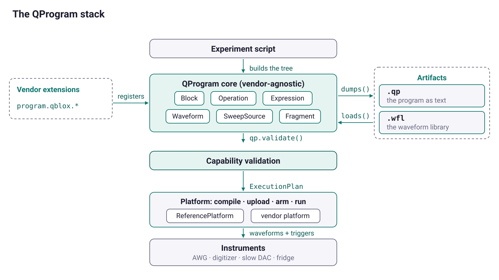
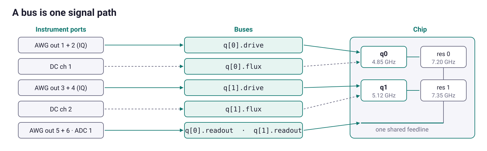
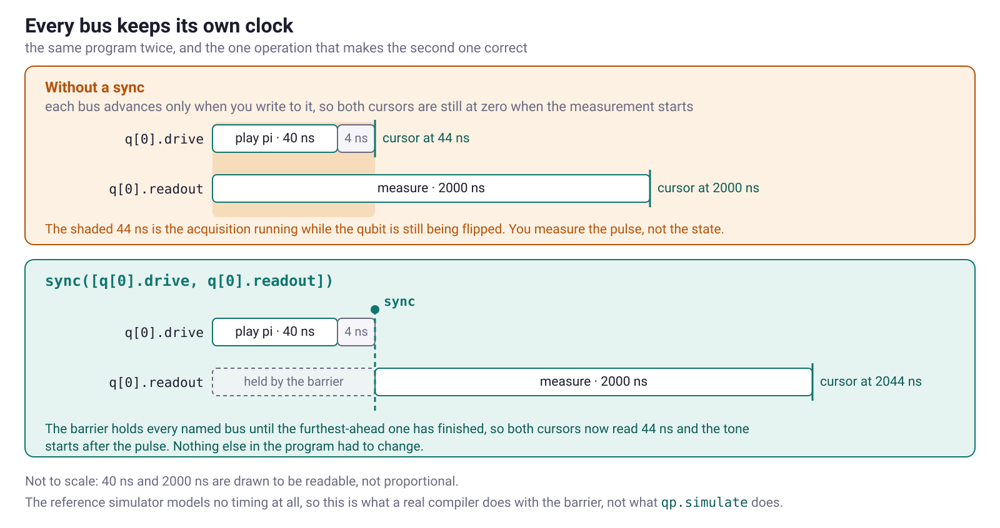
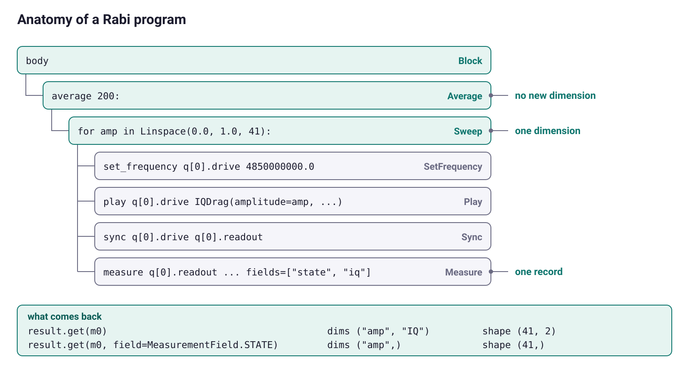
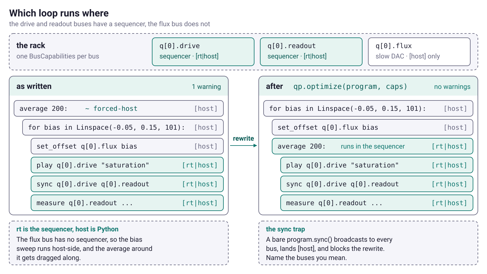

<style>
:root {
  --accent: #0f766e;
  --accent-soft: #e6f4f1;
  --ink: #1c1c2e;
}
section {
  font-family: -apple-system, "Segoe UI", Roboto, Helvetica, Arial, sans-serif;
  font-size: 26px;
  color: var(--ink);
  padding: 56px 72px;
  background: #ffffff;
}
h1, h2 { color: var(--accent); font-weight: 700; line-height: 1.1; }
h1 { font-size: 1.9em; }
h2 { font-size: 1.35em; }
h3 { color: var(--ink); }
strong { color: var(--accent); }
a { color: var(--accent); text-decoration: none; }
ul, ol { line-height: 1.45; }
code {
  background: var(--accent-soft); color: #0b5f58;
  padding: 2px 7px; border-radius: 5px; font-size: 0.86em;
}
pre { font-size: 0.72em; line-height: 1.35; }
pre code { background: none; padding: 0; }
table { font-size: 0.76em; }
th { background: var(--accent-soft); color: var(--accent); }
blockquote { font-size: 0.86em; color: #4a4a62; border-left: 4px solid var(--accent); padding-left: 16px; }
footer { color: #9a9ab0; font-size: 0.5em; }
section::after { color: #b6b6c8; font-weight: 600; }

section.lead { text-align: center; justify-content: center; }
section.lead h1 { font-size: 2.4em; margin-bottom: 0.1em; }
section.lead .sub { font-size: 1.15em; color: #55556e; }
section.lead .meta { font-size: 0.8em; color: #8a8aa0; margin-top: 1.4em; }

section.divider {
  background: linear-gradient(135deg, #0f766e 0%, #08403c 100%);
  color: #fff; justify-content: center;
}
section.divider h1, section.divider h2, section.divider h3 { color: #fff; }
section.divider strong { color: #ffd866; }
section.divider .kicker { font-size: 0.8em; letter-spacing: .18em; text-transform: uppercase; opacity: .8; }
section.divider code { background: rgba(255,255,255,.18); color: #fff; }

.cap { font-size: 0.72em; color: #6a6a82; text-align: center; margin-top: 6px; }
.center { text-align: center; }
.small { font-size: 0.82em; }
.big { font-size: 1.5em; color: var(--accent); font-weight: 700; text-align: center; margin: 0.3em 0; }

.qrgrid { display: flex; gap: 40px; justify-content: center; align-items: flex-start; margin-top: 28px; }
.qrgrid > div { text-align: center; width: 300px; }
.qrgrid img { width: 280px; height: 280px; background: #fff; padding: 8px; border: 1px solid #e6e6ef; border-radius: 10px; }
.qrgrid .lbl { font-weight: 700; color: var(--accent); margin: 14px 0 4px; font-size: 0.95em; }
.qrgrid .url { font-size: 0.72em; line-height: 1.35; word-break: break-word; }
.qrgrid .url a { color: #55556e; }
</style>

<!-- _class: lead -->
<!-- _paginate: false -->
<!-- _footer: '' -->

# Programming a Superconducting Qubit

<p class="sub">Pulse-Level Control and Calibration with QProgram</p>

<p class="meta">IEEE Quantum Week · QCE 2026</p>

---

## Introduction

- **Vyron Vasileiadis**, Tech Lead at **Qilimanjaro Quantum Tech** · vyron@qilimanjaro.tech
- **Qilimanjaro** builds quantum computers and the software stack that drives them.
- **QProgram** is the pulse-level layer of that stack, an open-source Python DSL for the pulses, sweeps, and measurements a calibration is made of.

Everything today runs on your laptop. QProgram ships a pure-Python reference platform, so there is
no fridge to book, no vendor SDK to install, and no cloud account to create.

---

## A chip arrives with no numbers on it

A circuit says `X(q0)`. To emit that pulse, an instrument has to be told:

```text
40 ns DRAG envelope,  IQ pair,  carrier 4.8501 GHz,  amplitude 0.6176,  sigma 10 ns,  beta 0.1
```

Six numbers. **Every one of them was measured**, on this chip, this week, by somebody running a
scan that has no gate-level spelling. Before the first circuit runs, twelve of those scans have to
succeed in order, each one consuming the answer from the last:

<p class="big">resonator → qubit → π pulse → coherence → readout → reset</p>

And the numbers move. Qubit frequencies wander with flux noise and with whatever two-level defects
the oxide is hosting this week. A $\pi$ amplitude is a $\pi$ amplitude until the attenuator drifts.

---

## What you are actually programming

A transmon is a circuit, not an atom. A capacitor and a Josephson junction on a silicon chip at
10 mK, with unevenly spaced energy levels so the bottom two can be addressed on their own. The gap
between them is 4.85 GHz, which is microwaves.

So you talk to it the way you talk to any microwave circuit, with voltages on coax. Each qubit has at most three lines, and each does exactly one job.

| line | what runs on it | what it does |
|---|---|---|
| **drive** | a microwave tone near $f_{01}$ | rotates the state |
| **readout** | a microwave tone near $f_r$ | interrogates a resonator coupled to the qubit |
| **flux** | a slow, near-DC voltage | moves $f_{01}$ |

**Every operation in this tutorial puts a voltage on one of those, or records what comes back.**

---

## From a gate to a voltage and back



<p class="cap">Three lines down, one line back. Attenuators on the way in because the chip needs microwatts, not watts; amplifiers on the way out because a few photons have to survive the trip to an ADC.</p>

---

## What a gate turns into

- **`X`** is a shaped burst on the drive line. Its **area** sets the rotation angle, its **phase**
  sets the axis. So `Y` is the same burst at 90 degrees, and `X/2` is half the amplitude. One
  envelope, two knobs, every single-qubit rotation.
- **`Z(θ)` plays nothing at all.** A $Z$ rotation is a change of reference frame: advance the phase
  of every later pulse on that line and the qubit cannot tell. Zero duration, zero error. Compilers
  push every $Z$ they can into that bookkeeping.
- **`CZ` is not a single-line operation.** Either a flux excursion that pushes one qubit into its
  neighbour, or a second microwave tone. 40 to 500 ns, calibrated per pair.

> Which leaves one gate unaccounted for, and it is the one that behaves least like its symbol.

---

## What `measure(q0)` actually returns

**Not a bit.**

You cannot see the qubit. You see a **resonator** coupled to it, whose frequency depends on the
qubit's state. The two frequencies sit $2\chi = 3.6$ MHz apart.

Send a tone past it. The returning field carries a state-dependent amplitude and phase, it is a few
tens of photons, and it climbs an amplifier chain before being digitized, multiplied by integration
weights, and summed into **one complex number**. Many shots give two clouds in the IQ plane. A
threshold between them is its own calibration, and Part 4 does it.

- **2 microseconds**, roughly 50 times longer than a gate
- **around 1% error**, ten to a hundred times worse than a good gate
- **non-demolition**: the qubit is left in the state you just measured, and Part 4's active reset is built on that

---

## The gates you cannot write

There is no circuit-level way to say any of this:

| What the experiment needs | Why no gate covers it |
|---|---|
| step a carrier over 81 points near 7.2 GHz | you do not know where the resonator is yet |
| a 2 us readout tone plus integration weights | the cavity fills in $1/\kappa \approx 100$ ns and the signal is a few photons |
| wait 8 us, then measure | that is one point of a $T_1$ curve |
| measure, then $\pi$-pulse **only if** it read 1 | passive reset costs $5T_1$, and that is 97% of your fridge time |
| hold the flux line at $+50$ mV while the drive sweeps | the sweet spot is where $T_2^*$ lives |

**Calibration is where lab time goes**, and calibration lives entirely below the gate.

---

## The state of control software in 2026

Physics moves between labs. You read a paper, you reproduce the measurement, nobody ships you a
machine.

**Control code has never moved at all.** Every vendor ships its own sequencer dialect, and they are
all assembly-shaped for good reasons: an FPGA has to hit a 4 ns clock edge without asking permission.
Register loops, cycle-counted branches, hand-addressed waveform memory. Correct, fast, welded to one
box.

And one decision gets hard-coded on line one of every script: **which loops run in the sequencer
and which run on the control PC**. A fact about the rack, not about the experiment, and getting it
wrong costs a factor of a hundred in wall clock.

> A second rack means rewriting experiments that were already correct, then spending a month
> re-earning trust in them.

---

## What QProgram is, and what it leaves alone

- A Python builder that produces an **AST**. `program.play(...)` appends a node; it does not send bytes.
- A **text format**, `.qp`, that the tree round-trips through exactly, so an experiment is a file you can diff, review, and rerun next year.
- A **capability protocol**: a platform declares what it supports per bus and per domain, and a program is checked against that before anything reaches hardware.
- A **reference platform** that interprets the tree in pure Python. It is the oracle vendor compilers get tested against, so "did my compiler get this right" becomes a question with an answer.

It is not a compiler, a scheduler, or a physics model. Those stay with the vendor, behind one
interface of six methods.

---

## Links & QR codes

<div class="qrgrid">
<div>

<div class="lbl">This tutorial</div>
<div class="url"><a href="https://github.com/qilimanjaro-tech/qce26-qprogram-tutorial">github.com/qilimanjaro-tech/<br>qce26-qprogram-tutorial</a></div>
</div>
<div>

<div class="lbl">QProgram source</div>
<div class="url"><a href="https://github.com/qilimanjaro-tech/qprogram">github.com/qilimanjaro-tech/qprogram</a></div>
</div>
<div>

<div class="lbl">Documentation</div>
<div class="url"><a href="https://qilimanjaro-tech.github.io/qprogram">qilimanjaro-tech.github.io/qprogram</a></div>
</div>
</div>

---

## Follow along

**Two ways to run everything, pick one:**

- **Local**: `pip install "qprogram[viz]" scipy` (Python 3.11 to 3.14), then open the notebooks.
- **Colab**: the first cell of every notebook installs what is missing, pinned to `0.1.0`.

**Right now:** open and run `notebooks/00_setup.ipynb`. Its last cell draws a resonator dip near 7.2 GHz. If you see the dip, you are ready.

> No hardware, no vendor package, no cloud account. The reference platform is part of the wheel.

---

## How we will work

- **Coding first.** These slides are the map. The work is in the notebooks, and the notebooks carry more than we will get through today, on purpose. They are what you take home.
- Each part is a short concept, a live code-along, then one or two 🧩 exercises on real problems.
- Two notebook flavours: `notebooks/` has blank `# TODO` cells, `notebooks/solutions/` has the answers and the outputs.
- Every snippet was run against `qprogram 0.1.0`. What a slide claims, a cell proves.
- Interrupt me. Lab stories are welcome, above all the ones that contradict the slide.

---

## Schedule

| Part | Notebook | Topic | Time |
|---|---|---|---|
| 1 | `01_pulse_programs` | The program is data | 35 min |
| 2 | `02_sweeps_and_results` | Sweeps, averaging, and results | 35 min |
| 3 | `03_finding_the_qubit` | Finding and driving the qubit | 40 min |
|  |  | break | 15 min |
| 4 | `04_coherence_and_feedback` | Coherence, single shots, feedback | 40 min |
| 5 | `05_one_program_many_machines` | Capabilities, plans, porting | 30 min |
| 6 | `06_extending_and_shipping` | Extending, shipping, capstone | 25 min |

3 hours 40 minutes with the break, which lands after Part 3. We flex with the room: Part 6's
capstone and the second exercise in Parts 2 and 5 are the pieces built to come out if we run long.

---

## The device we are calibrating

One simulated transmon, and every number in it is a number you will recover from a fit today.

| | | |
|---|---|---|
| $f_{01}$ = 4.85 GHz | $f_r$ = 7.20 GHz | $\Delta$ = $-2.35$ GHz |
| $\kappa$ = 1.5 MHz ($Q_L$ = 4800) | $\chi$ = $-1.8$ MHz | $2\chi/\kappa$ = 2.4 |
| $T_1$ = 18 us | $T_2^{*}$ = 9 us | $T_2$ = 16 us |

They are not independent, and Part 1 spends five minutes on how they constrain each other.
$2\chi/\kappa$ decides whether readout works at all. $1/T_2 = 1/2T_1 + 1/T_\varphi$ says $T_2$ can
never pass 36 us here. And $\kappa$ fixes the cavity fill time at 106 ns, which is why the readout
pulse is 2 us and not 200.

> Every fit you run today prints its answer next to the truth, so you can grade yourself.

---

## What you will build

- a **calibrated qubit**: resonator frequency, qubit frequency, and a $\pi$ pulse, all fitted from raw sweeps (Parts 2 and 3);
- a **coherence set**: $T_1$, $T_2^{*}$, and $T_2$ from echo, built out of reusable pulse fragments (Part 4);
- **single-shot readout** with a threshold, and **active reset** that reads the outcome and acts on it (Part 4);
- the **same calibration ported to a second rack**, checked against that rack before it runs (Part 5);
- your **own waveform, sweep source, and vendor operation**, then the whole bring-up as one script (Part 6).

By the end, a directory of `.qp` files and one `.wfl` library that another lab could load.

---

## The architecture



<p class="cap">Your script builds a tree. Validation decides what runs where. The platform compiles and runs it. The <code>.qp</code> and <code>.wfl</code> files fall out as artifacts.</p>

---

## A bus is one signal path



<p class="cap">One qubit owns three lines that share nothing, and one feedline carries every readout at once. So operations name the <em>line</em>, never the qubit.</p>

---

## 30 seconds of vocabulary

- **Bus**: a named signal path, `q[0].drive`. A string that also knows its channel type and whether it can acquire. Those two fields reject an IQ pulse on a flux line and a `measure` on a line with no ADC, at build time.
- **Waveform**: an envelope as data, `Gaussian(amplitude=0.3, duration=40, sigma=10)`. Comparable, serializable, and swappable for a string alias when the number is still being measured.
- **Sweep source**: what a loop iterates over. `Range`, `Linspace`, `Values`, `Logspace`, `File`. One loop block, pluggable source, and the source declares whether a sequencer can generate it.
- **Average**: the shot loop. It adds no dimension to the result, it averages one away.
- **Measurement handle**: what `measure()` returns. Use it to pull the array out, and to read `handle.state` for feedback.

---

## One more word: capability

Three mechanisms, because three different kinds of question:

- A **token** is set membership. `op.play`, `waveform.iq_drag`, `sweep.logspace`. Cheap to check, and a set of them serializes into a profile a vendor can publish.
- A **limit** is a number. `max_loop_nesting: 4` is a hard wall, because a sequencer runs loops out of registers and there is no spilling to memory.
- A **predicate** is code, for rules that depend on how two nodes interact. "This `wait` takes a variable, so what kind of sweep binds it?" No flat token can answer that.

Every slot splits into an `rt` half and a `host` half, and either may be `None`. A flux DAC with no
sequencer is `rt=None`, and that one field carries the whole story.

Validation returns **diagnostics** and never raises. Alongside them comes an **execution plan**:
every node labelled `[rt]`, `[host]`, `[rt|host]`, or `[--]`.

---

## The simulator, honestly

`qp.simulate(program, model=...)` walks the tree in Python. Loops bind variables, measurements write
records. It models the **shape** of an experiment. Nesting, averaging, one record per `measure`,
`NaN` where a conditional arm never ran.

It models **no timing and no waveform physics**. `wait` and `sync` change nothing in the numbers.
A $T_1$ curve decays because your model read `env["delay"]`, not because a qubit relaxed.

That is a choice about what is under test. A tutorial with a Lindblad solver behind it would teach
you to trust a simulation. This one puts the two things you actually carry to a fridge under test
instead: **the program**, which has to say the right thing to a machine, and **the analysis**, which
has to get the right number out of noisy data. Both are identical here and on hardware.

---

<!-- _class: divider -->

<p class="kicker">Part 1 · notebooks/01_pulse_programs.ipynb</p>

# The Program Is Data

### A readout pulse, a drive pulse, and the tree they build

---

## Part 1: the smallest useful program

```text
#!QProgram 1.0
schema: transmon
body:
  set_frequency q[0].readout 7200000000.0
  measure q[0].readout IQPair(I=Square(0.2, 2000), Q=Square(0.0, 2000)) ... name="q0/readout/m0"
```

Three things are already true of that text. It **round-trips** (`loads(dumps(p)).body == p.body`,
and the notebook asserts it). It is a **diff target**, so two calibration runs a week apart differ
by a handful of readable numbers. And it **type-checks against the chip**: `q[0].readout` knows it
carries two channels and has an ADC, so a `Square` on a drive line and a `measure` on a line with no
ADC both raise on the line that made the mistake.

Nothing here runs. Part 1 is build and inspect; Part 2 presses go.

---

## Part 1: every bus keeps its own clock



<p class="cap">A circuit has one global clock. A pulse program does not. Each bus advances only when you write to it, and <code>sync</code> is the barrier that brings them back together.</p>

---

## Part 1: waveforms are data, and the numbers leave the file

Why 2 us of readout tone? SNR grows as $\sqrt{t}$ against the amplifier chain, and the ceiling is
$T_1$, so 2 us against 18 us is about a ninth. Why a Gaussian and not a square on the drive line?
The $|1\rangle \to |2\rangle$ transition is 300 MHz away and a sharp edge puts power there.

`play`, `wait`, `sync`, `set_frequency`, `set_phase`, `set_gain`, `reset_phase`, `measure`. Each
call appends exactly one node. `program.body.elements`, `body.walk()`, `program.buses` read it back.

The one that matters most is a **string alias**: `play(q[0].drive, "pi")`. A script with `0.6176`
inlined is a script that *claims* a calibration; run it six months later and it produces numbers
that mean nothing. An alias cannot claim one, because it does not carry one.

> 🧩 Build a two-qubit prepare-and-read sequence, then edit a `.qp` file by hand and prove what changed.

---

<!-- _class: divider -->

<p class="kicker">Part 2 · notebooks/02_sweeps_and_results.ipynb</p>

# Sweeps, Averaging, and What Comes Back

### Resonator spectroscopy, then a punchout map

---

## Part 2: the first scan on a new chip

A resonator hangs off the feedline. Off resonance the tone sails past, on resonance the resonator
absorbs it, and the trace dips. Frequency from the centre, $\kappa$ from the width, and from the
**depth**, a loss budget: 90% deep means $Q_L/Q_c = 0.9$, so $Q_i = 48000$ against $Q_L = 4800$.
Overcoupled by ten, the right direction. A shallow dip means $Q_i$ collapsed.

You need a hole in the program, because a resonator's frequency depends on the kinetic inductance of
whatever film got sputtered that day, and the fab does not know it to better than a percent. One
percent of 7.2 GHz is 72 MHz against a 1.5 MHz linewidth.

```python
freq = program.variable("ro_freq")
with program.average(shots=200):
    with program.sweep(freq, qp.Range(7.19e9, 7.21e9, 0.2e6)):   # 101 points, not 100
```

`average` adds **no** dimension: `iq` becomes a mean, `state` becomes a population.

---

## Part 2: what a sweep costs, three ways

The scan above is 101 points x 200 shots = 20,200 executions of the sequence.

| where the loop runs | one execution | the scan |
|---|---|---|
| sequencer, passive reset | 2 us readout + $5T_1$ = 100 us | **2 s** |
| sequencer, active reset (Part 4) | a few us | **0.2 s** |
| host, one round trip per point | ~1 ms through driver and Python | **20 s** |

That factor of a hundred is why a sweep source declares `KIND` instead of just handing over a list.
`Range` and `Linspace` are `linear`, so a sequencer can run them from a register. `Values`,
`Logspace`, and `File` are `arbitrary`, and `Values` stays arbitrary even when its numbers are
evenly spaced, because a list of floats proves nothing about its own regularity.

> 🧩 Take the power axis log-spaced with `qp.Logspace`, then write the scan as a parallel pair and explain the dims.

---

## Part 2: punchout, and the 37 photons

Dispersive readout works because qubit and resonator are coupled but far apart, so they shift each
other without exchanging energy. That approximation has a validity limit, and it is a photon number:

$$n_{\text{crit}} = \frac{\Delta^2}{4g^2} \approx 37 \ \text{photons on this chip}$$

Below it, the resonator sits at $f_r + \chi$. Above it, the pull washes out and the resonator lands
on bare $f_r$. The 2D map of that crossover is how you pick a readout power: as many photons as you
can for SNR, few enough that there are still two states to tell apart.

Nested `with` statements are nested loops. `result.get(m0)` comes back as `xarray` with dims
`("ro_amp", "ro_freq", "IQ")`, outermost sweep first, named after your variable ids.
`sweep(a) | sweep(b)` steps two in lockstep and yields one dim `"a|b"`: a diagonal cut, not a grid.

---

## Anatomy of a Rabi program



<p class="cap">Every node contributes something to the answer: <code>sweep</code> creates an axis, <code>average</code> collapses one, <code>measure</code> creates a record, <code>play</code> carries the variable into the waveform.</p>

---

<!-- _class: divider -->

<p class="kicker">Part 3 · notebooks/03_finding_the_qubit.ipynb</p>

# Finding and Driving the Qubit

### Two-tone spectroscopy, Rabi, and the flux arc

---

## Part 3: you cannot see the qubit directly

Nothing you send at 7.2 GHz touches something at 4.85 GHz, and the drive line has no ADC. The qubit
is only ever observed **through** the resonator, and only because of $\chi$.

So run two tones. Park the readout in the dip, sweep a second tone on the drive line, and when it
hits $f_{01}$ the qubit excites, the resonator moves by $2\chi = 3.6$ MHz against a 1.5 MHz
linewidth, and the tone that was in the dip is suddenly off it.

That chain read backwards is why Part 2 comes first, in the tutorial and in the lab.

**A saturated transition tops out at 0.5.** Equal populations, no matter how hard you push. See a
two-tone peak above 0.5 and your readout classifier is wrong, not your qubit. `measure(...,
fields=(MF.STATE,))` asks for classified outcomes; `average` turns them into that population.

---

## Part 3: Rabi, and the number the rest of the day depends on

Fix the shape, sweep the amplitude, and the rotation angle is proportional to it, so the population
traces $\sin^2$ and the first maximum is the $\pi$ pulse. Ceiling of 1 this time, because this is a
coherent rotation and not a pumped steady state.

```text
a_pi fitted : 0.6176 +/- 0.0021        contrast: 0.997   floor: 0.002
a_pi true   : 0.6200
```

Fit for the parameter you want, not a generic sinusoid, and `curve_fit` hands you the error bar on
the number you care about. The contrast and floor come free and are a weekly health check: a floor
that creeps up means a warm qubit or a drifting classifier.

The variable lives **inside the waveform**, `IQDrag(amplitude=amp, ...)`, so the file records one
parametric pulse rather than 41 literal ones. The fitted result becomes the alias `"pi"` through
`with_waveforms(...)`, and the program text holds still while the calibration moves.

---

## Part 3: the flux arc, and a loop you never classified

A SQUID's Josephson energy goes as $|\cos(\pi\Phi/\Phi_0)|$ and $f_{01} \propto \sqrt{E_J}$, so

$$f_{01}(V) = f_{\max}\sqrt{\left|\cos\frac{\pi(V - V_0)}{V_\Phi}\right|}$$

The flat top is the **sweet spot**: $\mathrm{d}f_{01}/\mathrm{d}\Phi = 0$, first-order flux noise
does nothing, and that is where every coherence number in Part 4 gets measured.

Now look at what the program says. Two `for` loops written identically. The inner one retunes a
source and fires a pulse, microseconds per step. The outer one writes a DC voltage into a filtered
line that settles in milliseconds, on a box with no sequencer in it.

**You never wrote down which was which**, and you should not have to. Hold that until Part 5.

> 🧩 Fit the $\pi/2$ amplitude and check it against half the $\pi$ amplitude, then solve the arc for a target frequency.

---

<!-- _class: divider -->

<p class="kicker">Part 4 · notebooks/04_coherence_and_feedback.ipynb</p>

# Coherence, Single Shots, and Feedback

### T1, Ramsey, echo, and a reset that reads the outcome

---

## Part 4: three numbers, one sequence shape

Prepare, wait, read out. Only the middle changes, so write the pulse once. A `@fragment` is a named, parameterized sub-program, `program.call(x180, q[0].drive, 0.62)` appends one node, and `expand()`
inlines it. They round-trip into `.qp` as `fragment` sections, so a shared pulse library is a text
file too.

| | fitted | what it is |
|---|---|---|
| $T_1$ | 17.9 us | energy leaving, mostly Purcell decay and lossy oxides |
| $T_2^{*}$ | 8.9 us | plus every source of frequency wander, unfiltered |
| $T_2$ echo | 15.9 us | a $\pi$ pulse in the middle refocuses anything slower than the sequence |

$T_2^* < T_2 < 2T_1$ is arithmetic, not convention. And the gap between the last two is a
measurement of the noise: 60% of the dephasing rate removed means most of it lives below ~50 kHz,
right where $1/f$ flux noise is expected.

---

## Part 4: single shots, and an error that falls off a cliff

Stop averaging: put the shot index in an explicit `sweep` and every shot lands in the array. Two
clouds appear, because the resonator sits at $f_r \pm \chi$ and the integrated point lands in one of
two places.

$$\varepsilon = \tfrac{1}{2}\,\mathrm{erfc}\!\left(\frac{d}{2\sqrt{2}\sigma}\right)
\qquad 4\sigma \to 2\% \qquad 6\sigma \to 0.1\%$$

$d$ grows with photon number and $2\chi/\kappa$; $\sigma$ is amplifier noise over $\sqrt{t}$. That
is the whole of readout engineering, and the steepness is why every factor of two feels like a
different chip.

Then use one: `if_(handle.state == 1)` and play a $\pi$ pulse. Passive reset costs $5T_1$ = 90 us
per shot against a 2 us measurement, so **97% of your fridge time is waiting**. The arm that did not
run holds `NaN`, honestly, because a zero would look like a cold measurement.

> 🧩 Write the echo experiment from the fragments already defined, then report the population before and after reset.

---

<!-- _class: divider -->

<p class="kicker">Part 5 · notebooks/05_one_program_many_machines.ipynb</p>

# One Program, Many Machines

### The same calibration, a different rack

---

## Part 5: why the flux line is a different instrument

Rack B puts a 20-bit DC source on the flux line instead of an AWG output, and that is not a matter
of taste. Flux noise is the main thing dephasing this qubit, and the qubit frequency tracks the bias
directly, so the flux line is the one path where broadband noise turns straight into decoherence.

**The same filtering that keeps the line quiet is what keeps it slow.** Millisecond time constants,
Ethernet, no FPGA. That loop cannot be a sequencer loop, and it cannot be made into one.

Three questions have to be answered before the program reaches an instrument:

1. Does the rack implement every operation, waveform, and sweep shape used?
2. Does the program stay inside its numeric limits?
3. Which loops run in the sequencer, and which on the host?

`qp.validate(program, caps)` answers all three from the AST and **never raises**. `execute` is the step that turns an error into an exception.

---

## Part 5: read the plan, then let optimize fix it

```
body
└─ average 200:                        [host]    ~ forced-host  i reorderable-averaging
   └─ for bias in Linspace(...):       [host]
      ├─ set_offset q[0].flux bias     [host]
      ├─ play q[0].drive "saturation"  [rt|host]
      ├─ sync q[0].drive q[0].readout  [rt|host]
      └─ measure q[0].readout ...      [rt|host]
```

The `average` fell to `[host]` because it *encloses* a host-side sweep. A warning, not an error: it
runs, and 20,200 round trips take twenty seconds instead of a fraction of one.

The validator names its own fix. `reorderable-averaging` points at `qp.optimize(program, caps)`,
which rewrites `average { sweep { ... } }` into `sweep { setup; average { ... } }`. Now the host does
101 DAC writes and the sequencer does the rest.

One habit blocks it: a bare `program.sync()` broadcasts across every bus, picks up the flux line,
lands host-side, and the rewrite refuses to hoist across it. Name the two buses you mean.

---

## Part 5: rebind and waveform libraries

- `program.rebind(naming=BusNaming("{kind}_{element}{index}"))` renames every bus **structurally**, so the refs stay typed and the channel checks survive. A find-and-replace would give you strings that look right and carry no metadata.
- `rebind(elements={("q", 0): ("q", 3)})` moves the experiment to another qubit. `rebind(schema=...)` moves it to another chip layout.
- `WaveformLibrary` resolves a string alias per bus in three tiers: exact `(element, idx, kind, name)`, then family `(element, kind, name)`, then global `(name,)`. Drive pulses are exact because two qubits never share a $\pi$ amplitude; weights are global.

The library lives outside the `.qp` file, in its own `.wfl`. The program is the experiment and
changes when you change the experiment; the library is the calibration and changes every morning.
Merge them and neither diff means anything, because a recalibration and a redesign look identical.

> 🧩 Write a predicate that enforces your own rule, then port the Part 3 program to a lab that names buses `drive_q0` style.

---

## Part 5: the rack B someone already published

`qprogram-qdac` and `qprogram-qblox` register `qdac-default-v1` and `qblox-default-v1`.
`CompilerCapabilities.from_profile(name)` materializes either one. Neither package talks to an
instrument.

A published profile lists what the box implements, not what the language knows. `qdac-default-v1`
**refuses** `op.set_offset`, because a QDAC channel is a slow-control write and not a sequencer
opcode. So the flux line is spelled `program.qdac.set_offset` and the file grows `require qdac 0.1`.

Hand-built rack B filled both halves of every fast slot, so the mixed loop came back a `forced-host`
**warning**. The real profiles fill one half each, and the same loop is a `mixed-domain` **error**.

Which makes `qp.optimize` the step that turns an illegal program into a legal one, rather than a
rewrite that only buys speed. Whether an optimization is optional turns out to be a property of the
machine too.

---

## One program, two domains



<p class="cap">The drive and readout lines sit on a fast sequencer, the flux line on a slow DAC. The bias loop lands host-side, the shot loop stays in hardware, and <code>optimize()</code> is what gets them into that order.</p>

---

<!-- _class: divider -->

<p class="kicker">Part 6 · notebooks/06_extending_and_shipping.ipynb</p>

# Extending the Language and Shipping the Work

### Your own waveform, your own vendor, and the bring-up in one script

---

## Part 6: a DSL that cannot be extended gets forked

And a forked DSL is not a portable format, it is three dialects sharing a file extension. So the
extension points are what keep Part 5 true.

- A **waveform**: subclass `Waveform`, implement `envelope()` and `get_duration()`, decorate with `@qp.register_waveform`. Serialization is read off your constructor signature, so the constructor arguments have to *be* the state.
- A **sweep source**: subclass `qp.SweepSource`, declare `KIND` and `TOKEN`, implement `length()` and `values()`. It **may not wrap a callable**: a callable cannot report its length before running, cannot honestly declare a kind, and cannot serialize. Three load-bearing properties, all gone.
- A **vendor namespace**: one `Operation`, one `VendorNamespace` method, four registration calls. Then `program.fridge.set_attenuation(q[0].drive, 20.0)` works on any program.

All three fit in a notebook cell. That is the test of an extension point: no fork, no patch to the
core.

---

## Part 6: shipping it

The file grows `require fridge 0.1`, round-trips, and validates. A rack without the token reports
`missing-capability` and names the path. A rack **with** the extension missing entirely finds it
through a packaging entry point and imports it, so a six-month-old file loads without the reader
knowing what the author had installed.

```diff
-  set_frequency q[0].readout 7200000000.0
+  set_frequency q[0].readout 7200400000.0
-  average 200:
+  average 400:
-    for amp in Linspace(start=0.0, stop=1.0, num=41):
+    for amp in Linspace(start=0.0, stop=0.8, num=41):
```

Monday against Friday. The resonator moved 400 kHz, the shot count doubled, the amplitude range
came down. You can reconstruct the week from a text diff, and none of it is in a plot.

`python -m qprogram.lsp check run.qp` prints JSON diagnostics and exits non-zero, so it is a CI job.
`explain` prints the plan tree. Neither needs an extra dependency.

> 🧩 Add a vendor measurement field or a second vendor operation, then break a `.qp` file and fix it from the checker output.

---

## The bring-up, end to end

**resonator** → **qubit** → **π pulse** → **coherence** → **single shots** → **active reset** → **ported** → **shipped**

A dozen experiments, one set of primitives:

`BusSchema` · `Waveform` · `Variable` · `SweepSource` · `Fragment` · `MeasurementField`
 → assembled into an **AST** → checked against **capabilities** → run by a swappable **platform**.

The capstone runs all seven steps in order, feeding each fit into the next, and writes a `.qp` per
step plus one `.wfl`. Here that takes seconds. On hardware with passive reset it is about ten
minutes, and the reason to automate it is not those ten minutes, it is the fifty qubits after this
one.

> Two vendor packages, imported for what they declare rather than for what they drive. Nothing today talked to an instrument, and nothing today was written twice.

---

## Where to go next

- **Docs**: [qilimanjaro-tech.github.io/qprogram](https://qilimanjaro-tech.github.io/qprogram) · **Source**: [github.com/qilimanjaro-tech/qprogram](https://github.com/qilimanjaro-tech/qprogram)
- The published Reference section is the normative material, `docs/reference/qp-format.md` covers the text format, and `src/qprogram/grammar/qp.lark` is the machine-readable grammar.
- `qprogram-qblox` and `qprogram-qdac` are worked vendor extensions, and Part 5 built a rack from their profiles. Read one before you write your own.
- Bring a rule your lab cares about and write it as a predicate. That is the cheapest way to find out whether the protocol fits your rack.
- Issues and pull requests are welcome. The extension points are the API.

---

<!-- _class: lead -->
<!-- _footer: '' -->

# Thank you

<p class="sub">Questions, and the notebooks are yours to keep</p>

<p class="meta">vyron@qilimanjaro.tech · QCE 2026</p>
